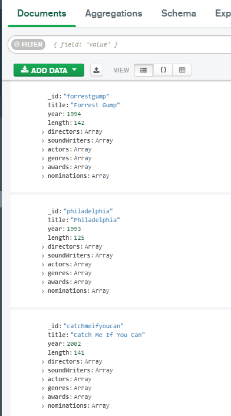

== MongoDB

.Data representation of database in MongoDB

.Create script
[%collapsible]
====
[source,javascript]
----
// people
db.people.insertOne({_id: "TomHanks", name: {first: "Tom", last: "Hanks"}, born: 1956, country: "USA", moviesDirected: ['larrycrowne'], moviesActed: [{movie: 'forrestgump', role: 'Forrest Gump'}, {movie: 'philadelphia'}, {movie: 'catchmeifyoucan'}, {movie: 'theterminal'}, {movie: 'cloudatlas'}, {movie: 'larrycrowne'}], awards: [{'movie': 'philadelphia', 'category': 'Golden Globes', 'name': 'Best Actor - Drama'}, {'movie': 'philadelphia', 'category': 'Oscar', 'name': 'Best Actor in Leading Role'}, {'movie': 'forrestgump', 'category': 'Oscar', 'name': 'Best Actor in Leading Role'}, {'movie': 'forrestgump', 'category': 'Golden Globes', 'name': 'Best Actor - Drama'}], nominations: [{'movie': 'forrestgump', 'category': 'The Saturn Awards', 'name': 'Best Actor'}] });
db.people.insertOne({_id: "GarySinise", name: {first: "Gary", last: "Sinise"}, born: 1955, country: "USA", moviesActed: [{movie: 'forrestgump', role: 'Lieutenant Dan Taylor'}], awards: [{'movie': 'forrestgump', 'category': 'The Saturn Awards', 'name': 'Best Supporting Actor'}], nominations: [{'movie': 'forrestgump', 'category': 'Oscar', 'name': 'Best Actor in Supporting Role'}, {'movie': 'forrestgump', 'category': 'Golden Globes', 'name': 'Best Actor in Supporting Role'}] });
db.people.insertOne({_id: "DenzelWashington", name: {first: "Denzel", last: "Washington"}, born: 1954, country: "USA", moviesActed: [{movie: 'philadelphia'}], awards: [], nominations: [] });
db.people.insertOne({_id: "LeonardoDiCaprio", name: {first: "Leonardo", last: "DiCaprio"}, born: 1974, country: "USA", moviesActed: [{movie: 'catchmeifyoucan'}, {movie: 'titanic', role: 'Jack Dawson'}, {movie: 'inception'}, {movie: 'onceuponatimeinhollywood'}], awards: [], nominations: [{'movie': 'titanic', 'category': 'Golden Globes', 'name': 'Best Actor - Comedy or Musical'}, {'movie': 'onceuponatimeinhollywood', 'category': 'Golden Globes', 'name': 'Best Actor - Drama'}, {'movie': 'catchmeifyoucan', 'category': 'Golden Globes', 'name': 'Best Actor - Drama'}] });
db.people.insertOne({_id: "CatherineZeta-Jones", name: {first: "Catherine", last: "Zeta-Jones"}, born: 1969, country: "UK", moviesActed: [{movie: 'theterminal'}], awards: [], nominations: [] });
db.people.insertOne({_id: "KateWinslet", name: {first: "Kate", last: "Winslet"}, born: 1975, country: "UK", moviesActed: [{movie: 'titanic', role: 'Rose DeWitt Bukater'}], awards: [], nominations: [{'movie': 'titanic', 'category': 'Oscar', 'name': 'Best Actress in Leading Role'}, {'movie': 'titanic', 'category': 'Golden Globes', 'name': 'Best Actress - Drama'}] });
db.people.insertOne({_id: "SamWorthington", name: {first: "Sam", last: "Worthington"}, born: 1976, country: "UK", moviesActed: [{movie: 'avatar', role: 'Jake Sully'}], awards: [{'movie': 'avatar', 'category': 'The Saturn Awards', 'name': 'Best Actor'}], nominations: [] });
db.people.insertOne({_id: "ZoeSaldana", name: {first: "Zoe", last: "Saldana"}, born: 1978, country: "USA", moviesActed: [{movie: 'avatar', role: 'Neytiri'}], awards: [], nominations: [] });
db.people.insertOne({_id: "ArnoldSchwarzenegger", name: {first: "Arnold", last: "Schwarzenegger"}, born: 1947, country: "Austria", moviesActed: [{movie: 'truelies'}], awards: [], nominations: [{'movie': 'truelies', 'category': 'The Saturn Awards', 'name': 'Best Actor'}] });
db.people.insertOne({_id: "JamieLeeCurtis", name: {first: "Jamie Lee", last: "Curtis"}, born: 1958, country: "USA", moviesActed: [{movie: 'truelies'}], awards: [{'movie': 'truelies', 'category': 'Golden Globes', 'name': 'Best Actress - Comedy or Musical'}, {'movie': 'truelies', 'category': 'The Saturn Awards', 'name': 'Best Actress'}], nominations: [] });
db.people.insertOne({_id: "ElliotPage", name: {first: "Elliot", last: "Page"}, born: 1987, country: "Canada", moviesActed: [{movie: 'inception'}], awards: [], nominations: [] });
db.people.insertOne({_id: "BradPitt", name: {first: "Brad", last: "Pitt"}, born: 1963, country: "USA", moviesActed: [{movie: 'onceuponatimeinhollywood'}, {movie: 'ocenanseleven'}, {movie: 'ocenanstwelve'}, {movie: 'oceansthirteen'}], awards: [], nominations: [] });
db.people.insertOne({_id: "MatthewMcConaughey", name: {first: "Matthew", last: "McConaughey"}, born: 1969, country: "USA", moviesActed: [{movie: 'interstellar'}], awards: [], nominations: [] });
db.people.insertOne({_id: "AnneHathaway", name: {first: "Anne", last: "Hathaway"}, born: 1982, country: "USA", moviesActed: [{movie: 'interstellar'}], awards: [], nominations: [] });
db.people.insertOne({_id: "FionnWhitehead", name: {first: "Fionn", last: "Whitehead"}, born: 1997, country: "USA", moviesActed: [{movie: 'dunkirk'}], awards: [], nominations: [] });
db.people.insertOne({_id: "TomHardy", name: {first: "Tom", last: "Hardy"}, born: 1977, country: "UK", moviesActed: [{movie: 'dunkirk'}], awards: [], nominations: [] });
db.people.insertOne({_id: "CillianMurphy", name: {first: "Cillian", last: "Murphy"}, born: 1976, country: "Ireland", moviesActed: [{movie: 'dunkirk'}], awards: [], nominations: [] });
db.people.insertOne({_id: "RobinWiliams", name: {first: "Robin", last: "Wiliams"}, born: 1951, country: "USA", moviesActed: [{movie: 'goodwillhunting'}], awards: [], nominations: [] });
db.people.insertOne({_id: "BenAffleck", name: {first: "Ben", last: "Affleck"}, born: 1972, country: "USA", moviesActed: [{movie: 'goodwillhunting'}], awards: [], nominations: [] });
db.people.insertOne({_id: "RussellCrowe", name: {first: "Russell", last: "Crowe"}, born: 1964, country: "USA", moviesActed: [{movie: 'abeautifulmind'}], awards: [{'movie': 'abeautifulmind', 'category': 'Golden Globes', 'name': 'Best Actor - Drama'}], nominations: [{'movie': 'abeautifulmind', 'category': 'Oscar', 'name': 'Best Actor in Leading Role'}] });
db.people.insertOne({_id: "JenniferConnelly", name: {first: "Jennifer", last: "Connelly"}, born: 1970, country: "USA", moviesActed: [{movie: 'abeautifulmind'}], awards: [{'movie': 'abeautifulmind', 'category': 'Oscar', 'name': 'Best Actress in Supporting Role'}, {'movie': 'abeautifulmind', 'category': 'Golden Globes', 'name': 'Best Actress in Supporting Role'}], nominations: [] });
db.people.insertOne({_id: "LiamNeeson", name: {first: "Liam", last: "Neeson"}, born: 1951, country: "UK", moviesActed: [{movie: 'schindlerslist'}], awards: [], nominations: [{'movie': 'schindlerslist', 'category': 'Oscar', 'name': 'Best Actor in Leading Role'}, {'movie': 'schindlerslist', 'category': 'Golden Globes', 'name': 'Best Actor - Drama'}] });
db.people.insertOne({_id: "RalphFiennes", name: {first: "Ralph", last: "Fiennes"}, born: 1962, country: "UK", moviesActed: [{movie: 'schindlerslist'}], awards: [], nominations: [{'movie': 'schindlerslist', 'category': 'Oscar', 'name': 'Best Actor in Supporting Role'}, {'movie': 'schindlerslist', 'category': 'Golden Globes', 'name': 'Best Actor in Supporting Role'}] });
db.people.insertOne({_id: "BenKingsley", name: {first: "Ben", last: "Kingsley"}, born: 1943, country: "UK", moviesActed: [{movie: 'schindlerslist'}], awards: [], nominations: [] });
db.people.insertOne({_id: "GeorgeClooney", name: {first: "George", last: "Clooney"}, born: 1961, country: "USA", moviesActed: [{movie: 'ocenanseleven'}, {movie: 'ocenanstwelve'}, {movie: 'oceansthirteen'}], awards: [], nominations: [] });

db.people.insertOne({_id: "JuliaRoberts", name: {first: "Julia", last: "Roberts"}, born: 1967, country: "USA", moviesActed: [{movie: 'ocenanseleven'}, {movie: 'ocenanstwelve'}, {movie: 'prettywoman'}, {movie: 'nottinghill'}, {movie: 'larrycrowne'}], awards: [{'movie': 'prettywoman', 'category': 'Golden Globes', 'name': 'Best Actress - Comedy or Musical'}], nominations: [] });
db.people.insertOne({_id: "KeanuReeves", name: {first: "Keanu", last: "Reeves"}, born: 1964, country: "Lebanon", moviesDirected: ['manoftaichi'], moviesActed: [{movie: 'thematrix', role: 'Neo'}, {movie: 'thematrixrevolutions', role: 'Neo'}, {movie: 'thematrixreloaded', role: 'Neo'}, {movie: "thedevilsadvocate"}, {movie: 'manoftaichi'}], awards: [], nominations: [{'movie': 'thematrix', 'category': 'The Saturn Awards', 'name': 'Best Actor'}] });
db.people.insertOne({_id: "LaurenceFishburne", name: {first: "Laurence", last: "Fishburne"}, born: 1961, country: "USA", awards: [], nominations: [] });
db.people.insertOne({_id: "ChrisPratt", name: {first: "Chris", last: "Pratt"}, born: 1979, country: "USA", moviesActed: [{movie: 'passengers'}], awards: [], nominations: [] });
db.people.insertOne({_id: "JenniferLawrence", name: {first: "Jennifer", last: "Lawrence"}, born: 1990, country: "USA", moviesActed: [{movie: 'passengers'}, {movie: 'thehungergames', role: 'Katniss Everdeen'}, {movie: 'thehungergamescatchingfire', role: 'Katniss Everdeen'}, {movie: 'redsparrow'}], awards: [], nominations: [] });
db.people.insertOne({_id: "LiamHemsworth", name: {first: "Liam", last: "Hemsworth"}, born: 1990, country: "Australia", moviesActed: [{movie: 'thehungergames', role: 'Gale Hawthorne'}, {movie: 'thehungergamescatchingfire', role: 'Gale Hawthorne'}], awards: [], nominations: [] });
db.people.insertOne({_id: "JoelEdgerton", name: {first: "Joel", last: "Edgerton"}, born: 1974, country: "Australia", awards: [], nominations: [] });
db.people.insertOne({_id: "NataliePortman", name: {first: "Natalie", last: "Portman"}, born: 1981, country: "Israel", moviesActed: [{movie: 'vforvendetta'}], awards: [], nominations: [] });
db.people.insertOne({_id: "HugoWeaving", name: {first: "Hugo", last: "Weaving"}, born: 1960, country: "Nigeria", moviesActed: [{movie: 'vforvendetta'}], awards: [], nominations: [] });
db.people.insertOne({_id: "HalleBerry", name: {first: "Halle", last: "Berry"}, born: 1966, country: "USA", moviesActed: [{movie: 'cloudatlas'}], awards: [], nominations: [] });
db.people.insertOne({_id: "RichardGere", name: {first: "Richard", last: "Gere"}, born: 1949, country: "USA", moviesActed: [{movie: 'prettywoman'}], awards: [], nominations: [{'movie': 'prettywoman', 'category': 'Golden Globes', 'name': 'Best Actor - Comedy or Musical'}] });
db.people.insertOne({_id: "AdrienBrody", name: {first: "Adrien", last: "Brody"}, born: 1973, country: "USA", moviesActed: [{movie: 'thepianist'}], awards: [], nominations: [] });
db.people.insertOne({_id: "EmiliaFox", name: {first: "Emilia", last: "Fox"}, born: 1974, country: "USA", moviesActed: [{movie: 'thepianist'}], awards: [], nominations: [] });
db.people.insertOne({_id: "AlPacino", name: {first: "Al", last: "Pacino"}, born: 1940, country: "USA", moviesActed: [{movie: "thedevilsadvocate"}], awards: [], nominations: [] });
db.people.insertOne({_id: "JohnTravolta", name: {first: "John", last: "Travolta"}, born: 1954, country: "USA", moviesActed: [{movie: 'pulpfiction'}], awards: [], nominations: [] });
db.people.insertOne({_id: "SamuelL.Jackson", name: {first: "Samuel L.", last: "Jackson"}, born: 1948, country: "USA", moviesActed: [{movie: 'pulpfiction'}], awards: [], nominations: [] });
db.people.insertOne({_id: "TigerChenHu", name: {first: "Tiger Chen", last: "Hu"}, born: 1975, country: "China", moviesActed: [{movie: 'manoftaichi'}], awards: [], nominations: [] });
db.people.insertOne({_id: "AlanSilvestri", name: {first: "Alan", last: "Silvestri"}, born: 1950, country: "USA", moviesSoundWritten: ['forrestgump'], awards: [], nominations: [{'movie': 'forrestgump', 'category': 'Oscar', 'name': 'Best Music'}] });
db.people.insertOne({_id: "HowardShore", name: {first: "Howard", last: "Shore"}, born: 1946, country: "Canada", moviesSoundWritten: ['philadelphia'], awards: [], nominations: [] });
db.people.insertOne({_id: "JohnWiliams", name: {first: "John", last: "Wiliams"}, born: 1932, country: "USA", moviesSoundWritten: ['catchmeifyoucan', 'theterminal', 'schindlerslist'], awards: [{'movie': 'schindlerslist', 'category': 'Oscar', 'name': 'Best Music'}], nominations: [{'movie': 'catchmeifyoucan', 'category': 'Oscar', 'name': 'Best Music'}, {'movie': 'schindlerslist', 'category': 'Golden Globes', 'name': 'Best Original Score'}] });
db.people.insertOne({_id: "JamesHorner", name: {first: "James", last: "Horner"}, born: 1953, country: "USA", moviesSoundWritten: ['titanic', 'avatar', 'abeautifulmind'], awards: [{'movie': 'titanic', 'category': 'Oscar', 'name': 'Best Music'}, {'movie': 'titanic', 'category': 'Golden Globes', 'name': 'Best Original Song'}], nominations: [{'movie': 'abeautifulmind', 'category': 'Oscar', 'name': 'Best Music'}, {'movie': 'abeautifulmind', 'category': 'Golden Globes', 'name': 'Best Original Score'}] });
db.people.insertOne({_id: "BradFiedel", name: {first: "Brad", last: "Fiedel"}, born: 1951, country: "USA", moviesSoundWritten: ['truelies'], awards: [], nominations: [] });
db.people.insertOne({_id: "HansZimmer", name: {first: "Hans", last: "Zimmer"}, born: 1957, country: "Germany", moviesSoundWritten: ['inception', 'interstellar', 'dunkirk'], awards: [], nominations: [] });
db.people.insertOne({_id: "DannyElfman", name: {first: "Danny", last: "Elfman"}, born: 1953, country: "USA", moviesSoundWritten: ['goodwillhunting'], awards: [], nominations: [] });
db.people.insertOne({_id: "DavidHolmes", name: {first: "David", last: "Holmes"}, born: 1971, country: "USA", moviesSoundWritten: ['ocenanseleven', 'ocenanstwelve', 'oceansthirteen'], awards: [], nominations: [] });
db.people.insertOne({_id: "DonDavis", name: {first: "Don", last: "Davis"}, born: 1965, country: "USA", moviesSoundWritten: ['thematrix', 'thematrixrevolutions', 'thematrixreloaded'], awards: [], nominations: [] });
db.people.insertOne({_id: "ThomasNewman", name: {first: "Thomas", last: "Newman"}, born: 1955, country: "USA", moviesSoundWritten: ['passengers'], awards: [], nominations: [] });
db.people.insertOne({_id: "JamesNewtonHoward", name: {first: "James Newton", last: "Howard"}, born: 1951, country: "USA", moviesSoundWritten: ['thehungergames', 'thehungergamescatchingfire', 'redsparrow', 'prettywoman', "thedevilsadvocate", 'larrycrowne'], awards: [], nominations: [] });
db.people.insertOne({_id: "TBoneBurnett", name: {first: "T Bone", last: "Burnett"}, born: 1948, country: "USA", moviesSoundWritten: ['thehungergames'], awards: [], nominations: [] });
db.people.insertOne({_id: "JoBlankenburg", name: {first: "Jo", last: "Blankenburg"}, born: 1972, country: "Germany", moviesSoundWritten: ['thehungergames'], awards: [], nominations: [] });
db.people.insertOne({_id: "DarioMarianelli", name: {first: "Dario", last: "Marianelli"}, born: 1963, country: "Italy", moviesSoundWritten: ['vforvendetta'], awards: [], nominations: [] });
db.people.insertOne({_id: "TomTykwer", name: {first: "Tom", last: "Tykwer"}, born: 1965, country: "Germany", moviesDirected: ['cloudatlas'], moviesSoundWritten: ['cloudatlas'], awards: [], nominations: [] });
db.people.insertOne({_id: "JohnnyKlimek", name: {first: "Johnny", last: "Klimek"}, born: 1962, country: "Australia", moviesSoundWritten: ['cloudatlas'], awards: [], nominations: [] });
db.people.insertOne({_id: "ReinholdHeil", name: {first: "Reinhold", last: "Heil"}, born: 1954, country: "Germany", moviesSoundWritten: ['cloudatlas'], awards: [], nominations: [] });
db.people.insertOne({_id: "TrevorJones", name: {first: "Trevor", last: "Jones"}, born: 1949, country: "South Africa", moviesSoundWritten: ['nottinghill'], awards: [], nominations: [] });
db.people.insertOne({_id: "WojciechKilar", name: {first: "Wojciech", last: "Kilar"}, born: 1932, country: "Ukraine", moviesSoundWritten: ['thepianist'], awards: [], nominations: [] });
db.people.insertOne({_id: "Kwong-WingChan", name: {first: "Kwong-Wing", last: "Chan"}, born: 1967, country: "Hong Kong", moviesSoundWritten: ['manoftaichi'], awards: [], nominations: [] });
db.people.insertOne({_id: "RobertZemeckis", name: {first: "Robert", last: "Zemeckis"}, born: 1951, country: "USA", moviesDirected: ['forrestgump'], awards: [{'movie': 'forrestgump', 'category': 'Oscar', 'name': 'Best Director'}, {'movie': 'forrestgump', 'category': 'Golden Globes', 'name': 'Best Director'}], nominations: [{'movie': 'forrestgump', 'category': 'The Saturn Awards', 'name': 'Best Director'}] });
db.people.insertOne({_id: "JonathanDemme", name: {first: "Jonathan", last: "Demme"}, born: 1944, country: "USA", moviesDirected: ['philadelphia'], awards: [], nominations: [] });
db.people.insertOne({_id: "StevenSpielberg", name: {first: "Steven", last: "Spielberg"}, born: 1946, country: "USA", moviesDirected: ['catchmeifyoucan', 'theterminal', 'schindlerslist'], awards: [{'movie': 'schindlerslist', 'category': 'Oscar', 'name': 'Best Director'}, {'movie': 'schindlerslist', 'category': 'Golden Globes', 'name': 'Best Director'}], nominations: [] });
db.people.insertOne({_id: "JamesCameron", name: {first: "James", last: "Cameron"}, born: 1954, country: "Canada", moviesDirected: ['titanic', 'avatar', 'truelies'], awards: [{'movie': 'titanic', 'category': 'Oscar', 'name': 'Best Director'}, {'movie': 'titanic', 'category': 'Golden Globes', 'name': 'Best Director'}, {'movie': 'avatar', 'category': 'Golden Globes', 'name': 'Best Director'}, {'movie': 'truelies', 'category': 'The Saturn Awards', 'name': 'Best Director'}], nominations: [] });
db.people.insertOne({_id: "ChristopherNolan", name: {first: "Christopher", last: "Nolan"}, born: 1970, country: "UK", moviesDirected: ['inception', 'interstellar', 'dunkirk'], awards: [], nominations: [] });
db.people.insertOne({_id: "QuentinTarantino", name: {first: "Quentin", last: "Tarantino"}, born: 1963, country: "USA", moviesDirected: ['onceuponatimeinhollywood', 'pulpfiction'], awards: [], nominations: [] });
db.people.insertOne({_id: "GusVanSant", name: {first: "Gus Van", last: "Sant"}, born: 1952, country: "USA", moviesDirected: ['goodwillhunting'], awards: [], nominations: [] });
db.people.insertOne({_id: "RonHoward", name: {first: "Ron", last: "Howard"}, born: 1954, country: "USA", moviesDirected: ['abeautifulmind'], awards: [], nominations: [{'movie': 'abeautifulmind', 'category': 'Oscar', 'name': 'Best Director'}, {'movie': 'abeautifulmind', 'category': 'Golden Globes', 'name': 'Best Director'}] });
db.people.insertOne({_id: "StevenSoderbergh", name: {first: "Steven", last: "Soderbergh"}, born: 1963, country: "USA", moviesDirected: ['ocenanseleven', 'ocenanstwelve', 'oceansthirteen'], awards: [], nominations: [] });
db.people.insertOne({_id: "MortenTyldum", name: {first: "Morten", last: "Tyldum"}, born: 1967, country: "Norway", moviesDirected: ['passengers'], awards: [], nominations: [] });
db.people.insertOne({_id: "LillyWachowski", name: {first: "Lilly", last: "Wachowski"}, born: 1967, country: "USA", moviesDirected: ['thematrix', 'thematrixrevolutions', 'thematrixreloaded', 'cloudatlas'], awards: [], nominations: [] });
db.people.insertOne({_id: "LanaWachowski", name: {first: "Lana", last: "Wachowski"}, born: 1965, country: "USA", moviesDirected: ['thematrix', 'thematrixrevolutions', 'thematrixreloaded', 'cloudatlas'], awards: [], nominations: [] });
db.people.insertOne({_id: "GaryRose", name: {first: "Gary", last: "Rose"}, born: 1956, country: "USA", moviesDirected: ['thehungergames'], awards: [], nominations: [] });
db.people.insertOne({_id: "FrancisLawrence", name: {first: "Francis", last: "Lawrence"}, born: 1971, country: "Austria", moviesDirected: ['thehungergamescatchingfire', 'redsparrow'], awards: [], nominations: [] });
db.people.insertOne({_id: "JamesMcTeigue", name: {first: "James", last: "McTeigue"}, born: 1967, country: "Australia", moviesDirected: ['vforvendetta'], awards: [], nominations: [] });
db.people.insertOne({_id: "GaryMarshall", name: {first: "Gary", last: "Marshall"}, born: 1934, country: "USA", moviesDirected: ['prettywoman'], awards: [], nominations: [] });
db.people.insertOne({_id: "RogerMichell", name: {first: "Roger", last: "Michell"}, born: 1956, country: "South Africa", moviesDirected: ['nottinghill'], awards: [], nominations: [] });
db.people.insertOne({_id: "RomanPolanski", name: {first: "Roman", last: "Polanski"}, born: 1933, country: "France", moviesDirected: ['thepianist'], awards: [], nominations: [] });
db.people.insertOne({_id: "TaylorHackford", name: {first: "Taylor", last: "Hackford"}, born: 1944, country: "USA", moviesDirected: ["thedevilsadvocate"], awards: [], nominations: [] });

//movies
db.movies.insertOne({_id: "forrestgump", title: "Forrest Gump", year: 1994, length: 142, directors: ['RobertZemeckis'], soundWriters: ['AlanSilvestri'], actors: ['TomHanks', 'GarySinise'], genres: ['drama', 'romance'], awards: [{'who': 'TomHanks', 'category': 'Oscar', 'name': 'Best Actor in Leading Role'}, {'who': 'RobertZemeckis', 'category': 'Oscar', 'name': 'Best Director'}, {'who': 'GarySinise', 'category': 'The Saturn Awards', 'name': 'Best Supporting Actor'}, {'who': 'TomHanks', 'category': 'Golden Globes', 'name': 'Best Actor - Drama'}, {'who': 'RobertZemeckis', 'category': 'Golden Globes', 'name': 'Best Director'}], nominations: [{'who': 'GarySinise', 'category': 'Oscar', 'name': 'Best Actor in Supporting Role'}, {'who': 'TomHanks', 'category': 'The Saturn Awards', 'name': 'Best Actor'}, {'who': 'RobertZemeckis', 'category': 'The Saturn Awards', 'name': 'Best Director'}, {'who': 'GarySinise', 'category': 'Golden Globes', 'name': 'Best Actor in Supporting Role'}, {'who': 'AlanSilvestri', 'category': 'Oscar', 'name': 'Best Music'}]});
db.movies.insertOne({_id: "philadelphia", title: "Philadelphia", year: 1993, length: 125, directors: ['JonathanDemme'], soundWriters: ['HowardShore'], actors: ['TomHanks', 'DenzelWashington'], genres: ['drama'], awards: [{'who': 'TomHanks', 'category': 'Golden Globes', 'name': 'Best Actor - Drama'}, {'who': 'TomHanks', 'category': 'Oscar', 'name': 'Best Actor in Leading Role'}], nominations: []});
db.movies.insertOne({_id: "catchmeifyoucan", title: "Catch Me If You Can", year: 2002, length: 141, directors: ['StevenSpielberg'], soundWriters: ['JohnWiliams'], actors: ['LeonardoDiCaprio', 'TomHanks'], genres: ['drama', 'biography', 'crime'], awards: [], nominations: [{'who': 'JohnWiliams', 'category': 'Oscar', 'name': 'Best Music'}, {'who': 'LeonardoDiCaprio', 'category': 'Golden Globes', 'name': 'Best Actor - Drama'}]});
db.movies.insertOne({_id: "theterminal", title: "The Terminal", year: 2004, length: 128, directors: ['StevenSpielberg'], soundWriters: ['JohnWiliams'], actors: ['TomHanks', 'CatherineZeta-Jones'], genres: ['drama', 'romance', 'comedy'], awards: [], nominations: []});
db.movies.insertOne({_id: "titanic", title: "Titanic", year: 1997, length: 194, directors: ['JamesCameron'], soundWriters: ['JamesHorner'], actors: ['LeonardoDiCaprio', 'KateWinslet'], genres: ['drama', 'romance'], awards: [{'who': 'JamesCameron', 'category': 'Oscar', 'name': 'Best Director'}, {'who': 'JamesHorner', 'category': 'Oscar', 'name': 'Best Music'}, {'who': 'JamesCameron', 'category': 'Golden Globes', 'name': 'Best Director'}, {'who': 'JamesHorner', 'category': 'Golden Globes', 'name': 'Best Original Song'}], nominations: [{'who': 'LeonardoDiCaprio', 'category': 'Golden Globes', 'name': 'Best Actor - Comedy or Musical'}, {'who': 'KateWinslet', 'category': 'Oscar', 'name': 'Best Actress in Leading Role'}, {'who': 'KateWinslet', 'category': 'Golden Globes', 'name': 'Best Actress - Drama'}]});
db.movies.insertOne({_id: "avatar", title: "Avatar", year: 2009, length: 164, directors: ['JamesCameron'], soundWriters: ['JamesHorner'], actors: ['SamWorthington', 'ZoeSaldana'], genres: ['action', 'adventure', 'fantasy'], awards: [{'who': 'SamWorthington', 'category': 'The Saturn Awards', 'name': 'Best Actor'}, {'who': 'JamesCameron', 'category': 'Golden Globes', 'name': 'Best Director'}], nominations: []});
db.movies.insertOne({_id: "truelies", title: "True Lies", year: 1994, length: 135, directors: ['JamesCameron'], soundWriters: ['BradFiedel'], actors: ['ArnoldSchwarzenegger', 'JamieLeeCurtis'], genres: ['action', 'comedy', 'thriller'], awards: [{'who': 'JamieLeeCurtis', 'category': 'Golden Globes', 'name': 'Best Actress - Comedy or Musical'}, {'who': 'JamieLeeCurtis', 'category': 'The Saturn Awards', 'name': 'Best Actress'}, {'who': 'JamesCameron', 'category': 'The Saturn Awards', 'name': 'Best Director'}], nominations: [{'who': 'ArnoldSchwarzenegger', 'category': 'The Saturn Awards', 'name': 'Best Actor'}]});
db.movies.insertOne({_id: "inception", title: "Inception", year: 2010, length: 148, directors: ['ChristopherNolan'], soundWriters: ['HansZimmer'], actors: ['LeonardoDiCaprio', 'ElliotPage'], genres: ['action', 'adventure', 'sci-fi'], awards: [], nominations: []});
db.movies.insertOne({_id: "onceuponatimeinhollywood", title: "Once Upon a Time In Hollywood", year: 2019, length: 161, directors: ['QuentinTarantino'], soundWriters: ['-'], actors: ['LeonardoDiCaprio', 'BradPitt'], genres: ['drama', 'comedy'], awards: [], nominations: [{'who': 'LeonardoDiCaprio', 'category': 'Golden Globes', 'name': 'Best Actor - Drama'}]});
db.movies.insertOne({_id: "interstellar", title: "Interstellar", year: 2014, length: 169, directors: ['ChristopherNolan'], soundWriters: ['HansZimmer'], actors: ['MatthewMcConaughey', 'AnneHathaway'], genres: ['drama', 'adventure', 'sci-fi'], awards: [], nominations: []});
db.movies.insertOne({_id: "dunkirk", title: "Dunkirk", year: 2017, length: 106, directors: ['ChristopherNolan'], soundWriters: ['HansZimmer'], actors: ['FionnWhitehead', 'TomHardy', 'CillianMurphy'], genres: ['drama', 'action', 'history'], awards: [], nominations: []});
db.movies.insertOne({_id: "goodwillhunting", title: "Good Will Hunting", year: 1997, length: 126, directors: ['GusVanSant'], soundWriters: ['DannyElfman'], actors: ['RobinWiliams', 'BenAffleck'], genres: ['drama', 'romance'], awards: [], nominations: []});
db.movies.insertOne({_id: "abeautifulmind", title: "A Beautiful Mind", year: 2001, length: 135, directors: ['RonHoward'], soundWriters: ['JamesHorner'], actors: ['RussellCrowe', 'JenniferConnelly'], genres: ['drama', 'biography'], awards: [{'who': 'JenniferConnelly', 'category': 'Oscar', 'name': 'Best Actress in Supporting Role'}, {'who': 'JenniferConnelly', 'category': 'Golden Globes', 'name': 'Best Actress in Supporting Role'}, {'who': 'RussellCrowe', 'category': 'Golden Globes', 'name': 'Best Actor - Drama'}], nominations: [{'who': 'RonHoward', 'category': 'Oscar', 'name': 'Best Director'}, {'who': 'RussellCrowe', 'category': 'Oscar', 'name': 'Best Actor in Leading Role'}, {'who': 'JamesHorner', 'category': 'Oscar', 'name': 'Best Music'}, {'who': 'RonHoward', 'category': 'Golden Globes', 'name': 'Best Director'}, {'who': 'JamesHorner', 'category': 'Golden Globes', 'name': 'Best Original Score'}]});
db.movies.insertOne({_id: 'schindlerslist', title: "Schindler's List", year: 1993, length: 195, directors: ['StevenSpielberg'], soundWriters: ['JohnWiliams'], actors: ['LiamNeeson', 'RalphFiennes', 'BenKingsley'], genres: ['drama', 'biography', 'history'], awards: [{'who': 'StevenSpielberg', 'category': 'Oscar', 'name': 'Best Director'}, {'who': 'JohnWiliams', 'category': 'Oscar', 'name': 'Best Music'}, {'who': 'StevenSpielberg', 'category': 'Golden Globes', 'name': 'Best Director'}], nominations: [{'who': 'LiamNeeson', 'category': 'Oscar', 'name': 'Best Actor in Leading Role'}, {'who': 'RalphFiennes', 'category': 'Oscar', 'name': 'Best Actor in Supporting Role'}, {'who': 'JohnWiliams', 'category': 'Golden Globes', 'name': 'Best Original Score'}, {'who': 'LiamNeeson', 'category': 'Golden Globes', 'name': 'Best Actor - Drama'}, {'who': 'RalphFiennes', 'category': 'Golden Globes', 'name': 'Best Actor in Supporting Role'}]});
db.movies.insertOne({_id: 'ocenanseleven', title: "Ocenan's Eleven", year: 2001, length: 116, directors: ['StevenSoderbergh'], soundWriters: ['DavidHolmes'], actors: ['GeorgeClooney', 'JuliaRoberts', 'BradPitt'], genres: ['crime', 'thriller'], awards: [], nominations: []});
db.movies.insertOne({_id: 'ocenanstwelve', title: "Ocenan's Twelve", year: 2004, length: 121, directors: ['StevenSoderbergh'], soundWriters: ['DavidHolmes'], actors: ['GeorgeClooney', 'JuliaRoberts', 'BradPitt'], genres: ['crime', 'thriller'], awards: [], nominations: []});
db.movies.insertOne({_id: 'oceansthirteen', title: "Ocean's Thirteen", year: 2007, length: 122, directors: ['StevenSoderbergh'], soundWriters: ['DavidHolmes'], actors: ['GeorgeClooney', 'BradPitt'], genres: ['crime', 'thriller'], awards: [], nominations: []});
db.movies.insertOne({_id: "thematrix", title: "The Matrix", year: 1996, length: 136, directors: ['LillyWachowski', 'LanaWachowski'], soundWriters: ['DonDavis'], actors: ['KeanuReeves'], genres: ['action', 'sci-fi'], awards: [], nominations: [{'who': 'KeanuReeves', 'category': 'The Saturn Awards', 'name': 'Best Actor'}]});
db.movies.insertOne({_id: "thematrixrevolutions", title: "The Matrix Revolutions", year: 2003, length: 129, directors: ['LillyWachowski', 'LanaWachowski'], soundWriters: ['DonDavis'], actors: ['KeanuReeves'], genres: ['action', 'sci-fi'], awards: [], nominations: []});
db.movies.insertOne({_id: "thematrixreloaded", title: "The Matrix Reloaded", year: 2003, length: 138, directors: ['LillyWachowski', 'LanaWachowski'], soundWriters: ['DonDavis'], actors: ['KeanuReeves'], genres: ['action', 'sci-fi'], awards: [], nominations: []});
db.movies.insertOne({_id: "passengers", title: "Passengers", year: 2016, length: 116, directors: ['MortenTyldum'], soundWriters: ['ThomasNewman'], actors: ['ChrisPratt', 'JenniferLawrence'], genres: ['drama', 'romance', 'sci-fi'], awards: [], nominations: []});
db.movies.insertOne({_id: "thehungergames", title: "The Hunger Games", year: 2012, length: 144, directors: ['GaryRose'], soundWriters: ['JamesNewtonHoward', 'TBoneBurnett', 'JoBlankenburg'], actors: ['JenniferLawrence', 'LiamHemsworth'], genres: ['action', 'adventure', 'sci-fi'], awards: [], nominations: []});
db.movies.insertOne({_id: "thehungergamescatchingfire", title: "The Hunger Games: Catching Fire", year: 2013, length: 146, directors: ['FrancisLawrence'], soundWriters: ['JamesNewtonHoward'], actors: ['JenniferLawrence', 'LiamHemsworth'], genres: ['drama', 'adventure', 'action'], awards: [], nominations: []});
db.movies.insertOne({_id: "redsparrow", title: "Red Sparrow", year: 2018, length: 140, directors: ['FrancisLawrence'], soundWriters: ['JamesNewtonHoward'], actors: ['JenniferLawrence'], genres: ['drama', 'action', 'thriller'], awards: [], nominations: []});
db.movies.insertOne({_id: "vforvendetta", title: "V For Vendetta", year: 2005, length: 132, directors: ['JamesMcTeigue'], soundWriters: ['DarioMarianelli'], actors: ['NataliePortman', 'HugoWeaving'], genres: ['action', 'sci-fi', 'thriller'], awards: [], nominations: []});
db.movies.insertOne({_id: "cloudatlas", title: "Cloud Atlas", year: 2012, length: 165, directors: ['LanaWachowski', 'TomTykwer', 'LillyWachowski'], soundWriters: ['TomTykwer', 'JohnnyKlimek', 'ReinholdHeil'], actors: ['TomHanks', 'HalleBerry'], genres: ['drama', 'action', 'mystery'], awards: [], nominations: []});
db.movies.insertOne({_id: "prettywoman", title: "Pretty Woman", year: 1990, length: 119, directors: ['GaryMarshall'], soundWriters: ['JamesNewtonHoward'], actors: ['RichardGere', 'JuliaRoberts'], genres: ['romance', 'comedy'], awards: [{'who': 'JuliaRoberts', 'category': 'Golden Globes', 'name': 'Best Actress - Comedy or Musical'}], nominations: [{'who': 'RichardGere', 'category': 'Golden Globes', 'name': 'Best Actor - Comedy or Musical'}]});
db.movies.insertOne({_id: "nottinghill", title: "Notting Hill", year: 1999, length: 124, directors: ['RogerMichell'], soundWriters: ['TrevorJones'], actors: ['JuliaRoberts', 'HughGrant'], genres: ['drama', 'romance', 'comedy'], awards: [], nominations: []});
db.movies.insertOne({_id: "thepianist", title: "The Pianist", year: 2002, length: 150, directors: ['RomanPolanski'], soundWriters: ['WojciechKilar'], actors: ['AdrienBrody', 'EmiliaFox'], genres: ['drama', 'biography', 'music', 'history'], awards: [], nominations: []});
db.movies.insertOne({_id: "thedevilsadvocate", title: "The Devil's Advocate", year: 1997, length: 144, directors: ['TaylorHackford'], soundWriters: ['JamesNewtonHoward'], actors: ['KeanuReeves', 'AlPacino'], genres: ['drama', 'mystery', 'thriller'], awards: [], nominations: []});
db.movies.insertOne({_id: "pulpfiction", title: "Pulp Fiction", year: 1994, length: 154, directors: ['QuentinTarantino'], soundWriters: ['-'], actors: ['JohnTravolta', 'SamuelL.Jackson'], genres: ['drama', 'crime'], awards: [], nominations: []});
db.movies.insertOne({_id: "manoftaichi", title: "Man of Tai Chi", year: 2013, length: 105, directors: ['KeanuReeves'], soundWriters: ['Kwong-WingChan'], actors: ['TigerChenHu', 'KeanuReeves'], genres: ['drama', 'action'], awards: [], nominations: []});
db.movies.insertOne({_id: "larrycrowne", title: "Larry Crowne", year: 2011, length: 94, directors: ['TomHanks'], soundWriters: ['JamesNewtonHoward'], actors: ['TomHanks', 'JuliaRoberts'], genres: ['drama', 'comedy', 'romance'], awards: [], nominations: []});
----
====

=== 1. Find movies with the title “Passengers”. Return movie titles and years.

Selection based on `title`, projects `title` and `year`.
Hides `_id` which is included by default.

[source,javascript]
----
db.movies.find({"title": "Passengers"}, {title: 1, year: 1, _id: 0})
----

=== 2. Find movies with “The” contained in the title. Return movie titles and years.

Selection based on `title`, which is filtered using case-insensitive regex expression.
Projects `title`, `year`, hides `_id`.

[source,javascript]
----
db.movies.find({"title": {$regex: /the/i}}, {title: 1, year: 1, _id: 0})
----

=== 3. Find movies directed by James Cameron. Return movie titles together with all the actor full names (merged first and last names) that acted in those movies.

We use `$lookup` to get info about directors.
Then we select only movies with `James Cameron` as director.
Next, we use another `$lookup` to join actors in those movies,
split the `actorsDetail` array using `$unwind`
and project the data including `fullName` that uses `$concat` to join first and last name from the separate fields.

[source,javascript]
----
db.movies.aggregate([
    {
        $lookup: {
            from: "people",
            localField: "directors",
            foreignField: "_id",
            as: "directorDetail"
        }
    },
    {
        $match: {
            $and: [
                {"directorDetail.name.first": "James"},
                {"directorDetail.name.last": "Cameron"}
            ]
        }
    },
    {
        $lookup: {
            from: "people",
            localField: "actors",
            foreignField: "_id",
            as: "actorsDetail"
        }
    },
    {
        $unwind: "$actorsDetail"
    },
    {
        $project: {
            _id: 0,
            title: 1,
            "fullName": {
                $concat: [ "$actorsDetail.name.first", " ", "$actorsDetail.name.last" ]
            }
        }
    }
])
----

=== 4. Find movies with connection (actor, director, soundtrack writer, …) to some person from Germany. Return movie titles and years together with all person first and last names, sorted by movie title, ascending, and then last name, descending.

This task a bit tricky.
First, we need to filter people by their country.
Then we need to do 3 lookups, for actors, directors and soundtrack writers, and lookup their movie ids to objects.
Then, we merge these arrays using `$setUnion`,
which should remove all duplicates.
We use `$unwind` to unwind (split array to separate records) this movie array.
And finally we project data and sort them.

[source,javascript]
----
db.people.aggregate([
    {
        $match: { country: "Germany" }
    },
    {
        $lookup: {
            from: "movies",
            localField: "moviesActed.movie",
            foreignField: "_id",
            as: "moviesActedDetail"
        }
    },
    {
        $lookup: {
            from: "movies",
            localField: "moviesDirected",
            foreignField: "_id",
            as: "moviesDirectedDetail"
        }
    },
    {
        $lookup: {
            from: "movies",
            localField: "moviesSoundWritten",
            foreignField: "_id",
            as: "moviesSoundWrittenDetail"
        }
    },
    {
        $project: {
            "name": 1,
            // merge movies - actors, directors, soundtrack writers
            allMoviesDetails: {
                $setUnion: ["$moviesActedDetail", "$moviesDirectedDetail", "$moviesSoundWrittenDetail"]
            }
        }
    },
    {
        $unwind: "$allMoviesDetails"
    },
    {
        $project: {
            "title": "$allMoviesDetails.title",
            "year": "$allMoviesDetails.year",
            "name": 1,
            "_id": 0
        }
    },
    {
        $sort: {
            "allMoviesDetails.title": 1,
            "name.last": -1
        }
    }
])
----

=== 5. Find movie titles in which Al Pacino or Julia Roberts acted in.

You have two options here:
start from the side of movies or people.

In the first example
we start from the side of movies.
For that,
we need to use `$lookup` to join people to each movie,
then we filter movies' actors
and finally project the results.

[source,javascript]
----
db.movies.aggregate([
    {
        $lookup: {
            from: "people",
            localField: "actors",
            foreignField: "_id",
            as: "actorsDetail"
        }
    },
    {
        $match: {
            $or: [
                {"actorsDetail.name.first": "Julia", "actorsDetail.name.last": "Roberts"},
                {"actorsDetail.name.first": "Al", "actorsDetail.name.last": "Pacino"}
            ]
        }
    },
    {
        $project: {
            "title": 1,
            "_id": 0
        }
    }
])
----

Second approach uses people collection.
Here we match people,
then use `$lookup` to join movies,
then use ˙$unwind` to split the `moviesActedDetail` array
and project title of those movies.

[source,javascript]
----
db.people.aggregate([
    {
        $match: {
            $or: [
                {"name.first": "Julia", "name.last": "Roberts"},
                {"name.first": "Al", "name.last": "Pacino"}
            ]
        }
    },
    {
        $lookup: {
            from: "movies",
            localField: "moviesActed.movie",
            foreignField: "_id",
            as: "moviesActedDetail"
        }
    },
    {
        $unwind: "$moviesActedDetail"
    },
    {
        $project: {
            title: "$moviesActedDetail.title",
            "_id": 0
        }
    }
])
----

=== 6. Find movie titles in which Tom Hanks has some connection to it (with excluded acted in connection).

Firstly, we need to find movies where Tom Hanks
was the director or soundtrack composer using $or operator.
Secondly we need to filter out movies in which he did not act
and join these queries together using $and operator.

[source,javascript]
----
db.movies.find(
    {
        $or: [
            {directors: "TomHanks"},
            {soundWriters: "TomHanks"}
        ]
    },
    { title: 1, _id: 0 }
)
----

=== 7. Find movies where at least one actor played.

The easiest approach seems to be using the `$size` operator,
which tests the size of an array together with `$gte` operator.

Using this query:

[source,javascript]
----
db.movies.find(
    {
        actors: {
            $size: { $gte:1 }
        }
    }
)
----

leads into an error message that says that size needs a number.
That’s because `$size` has to be used against a fixed number.

Correct approach is to check whether the first element of the array exists which means it contains at least one item.

[source,javascript]
----
db.movies.find(
    {
        "actors.0": { $exists: true }
    },
    { title: 1, _id: 0 }
)
----

Or better, use `$where` like this:

[source,javascript]
----
db.movies.find(
    {
        $where: "this.actors.length >= 1"
    },
    { title: 1, _id: 0 }
)
----

=== 8. Find movies with most people with awards and award nominations. Return movie titles, count of awards and count of award nominations, sorted in descending order by award counts. Display only movies that have at least 1 award or nomination.

First we created new fields `awardsCount` and `nominationsCount`
according to size of the `awards` and `nominations` array of given movie.
Then we created a new fields giving the sum of these two fields.
After that we match, sort and project the data.

[source,javascript]
----
db.movies.aggregate([
    {
        $addFields: {
            awardsCount: {
                $cond: {
                    if: { $isArray: "$awards" },
                    then: { $size: "$awards" },
                    else: 0
                }
            },
            nominationsCount: {
                $cond: {
                    if: { $isArray: "$nominations" },
                    then: { $size: "$nominations" },
                    else: 0
                }
            }
        }
    },
    {
        $addFields: {
            total: { $add: ["$awardsCount", "$nominationsCount"] }
        }
    },
    {
        $match: {
            total: { $gte: 1 }
        }
    },
    {
        $sort: {
            awardsCount: -1
        }
    },
    {
        $project: {
            _id: 0,
            title: 1,
            awardsCount: 1,
            nominationsCount:1
        }
    }
])
----

=== 9. Find people that acted in any movie (aka actors). Return person first and last names and years of birth ordered by the year, last name, first name, each in ascending order. Limit the output to 10 results.

To find if some person acted in movie,
we look at first (0 based) index and ask if it exists.
Then we sort and limit the output.

[source,javascript]
----
db.people.find(
    {
        "moviesActed.0": { $exists: true }
    },
    {
        "name": 1,
        "born": 1
    }
).sort({
    "born": 1,
    "name.last": 1,
    "name.first": 1
}).limit(10)
----

=== 10. Count people by country of origin. Return country name and the count, ordered by the count value.

Using the `$group` expression,
people are grouped by their country
and counted using `$sum`.

[source,javascript]
----
db.people.aggregate([
    {
        $group: {
            _id: "$country",
            count: { $sum: 1 }
        }
    },
    {
        $sort: { count: -1 }
    }
])
----

=== 11. Find people that both acted in and directed some movies. Return person first and last name together with movie titles and years. Order output by movie year in descending order and person last name and first name in ascending order.

Firstly projection is applied to find intersection between the array of actors and directors for every movie.
Only those movies that contain intersections are chosen.
Then we use lookup to get detailed info about every person from this intersection.
Finally, we have to use projections to get rid of array-like fields
and then the output is sorted.

[source,javascript]
----
db.movies.aggregate([
    {
        $project: {
            title: 1,
            year: 1,
            common: {
                $setIntersection: ["$actors", "$directors"]
            }
        }
    },
    {
        $match: {
            "common.0": { $exists: "true" }
        }
    },
    {
        $lookup: {
            from: "people",
            localField: "common",
            foreignField: "_id",
            as: "commonDetail"
        }
    },
    {
        $project: {
            firstName: {
                $first: "$commonDetail.name.first"
            },
            lastName: {
                $first: "$commonDetail.name.last"
            },
            title: 1,
            year: 1,
            _id: 0
        }
    },
    {
        $sort: {
            year: -1,
            lastName: 1,
            firstName: 1
        }
    }
])
----

=== 12. Find actors (people that acted in some movie) that did not act with Leonardo DiCaprio in the same movie. Return person first and last names and country of origin, sorted by person first and last name in ascending order.

First we join actors using `$lookup`.
Then we filter only those movies where Leonardo didn't played.
Then we split actors using `$unwind`,
remove duplicates,
replace root to actors,
so we end up with people collection.
And finally we project and sort data.

[source,javascript]
----
db.movies.aggregate([
    {
        $lookup: {
            from: "people",
            localField: "actors",
            foreignField: "_id",
            as: "actorsDetail"
        }
    },
    {
        $match: {
            $and: [
                {"actorsDetail.name.first": { $ne: "Leonardo" } },
                {"actorsDetail.name.last": {$ne: "DiCaprio"}}
            ]
        }
    },
    {
        $unwind: "$actorsDetail"
    },
    {
        $group: {
            _id: "$actorsDetail._id",
            data: { "$first": "$$ROOT" },
        }
    },
    {
        $replaceRoot: { "newRoot": "$data.actorsDetail" }
    },
    {
        $project: {
            "name.first": 1,
            "name.last": 1,
            "country": 1,
            "_id": 0
        }
    },
    {
        $sort: {
            "name.first": 1,
            "name.last": 1
        }
    }
])
----

=== 13. Find people that acted in a movie in the role of Neo. Return movie titles together with person first and last names, sorted by year of a movie in descending order.

For this task to work,
first we need to filter people that acted in a role of `Neo`.
Because that person can have multiple other movies,
we need to split by movies using `$unwind` and then do another same match,
to filter out the movies where the actor did not play.
We could have skipped the first `$match`,
but for performance reasons we keep it there.
Then we join movies using `$lookup`.
And finally, we project and sort the data.

[source,javascript]
----
db.people.aggregate([
    {
        $match: {
            "moviesActed.role": "Neo"
        }
    },
    {
        $unwind: "$moviesActed"
    },
    {
        $match: {
            "moviesActed.role": "Neo"
        }
    },
    {
        $lookup: {
            from: "movies",
            localField: "moviesActed.movie",
            foreignField: "_id",
            as: "moviesActedDetail"
        }
    },
    {
        $project: {
            "title": "$moviesActedDetail.title",
            "firstName": "name.first",
            "lastName": "name.last"
        }
    },
    {
        $sort: {
            "year": -1
        }
    }
])
----

=== 14. Find 5 oldest people that worked (in any role) on a movie. Return person last names and years of birth, ordered by year of birth in ascending order.

Simple projection which is sorted and limited.

[source,javascript]
----
db.people.find(
    {},
    {
        "name.last": 1,
        "born": 1,
        _id:0
    }
).sort({
    born: 1
}).limit(5)
----

=== 15. Find people that wrote a soundtrack for a movie The Hunger Games. Find all movies they made the soundtrack for. Return movie titles, years and length ordered by movie years in descending order.

First,
we need to find people that worked on `The Hunger Games` using `$match`.
Then we join soundtrack writers using `$lookup`.
Then we project movies they wrote soundtrack for,
split them using `$unwind`,
replace root, so we work with arrays with those movie ids,
`$unwind` again to get all the ids,
so we can join movies using `$lookup`.
We replace duplicates using `$group` and using `$replaceRoot` we work with collection of movies now.
Finally, we project and sort the data.

Quite tricky, this task.

[source,javascript]
----
db.movies.aggregate([
    {
        $match: {
            "title": "The Hunger Games"
        }
    },
    {
        $lookup: {
            from: "people",
            localField: "soundWriters",
            foreignField: "_id",
            as: "soundWritersDetail"
        }
    },
    {
        $project: {
            "soundWritersDetail.moviesSoundWritten": 1
        }
    },
    {
        $unwind: "$soundWritersDetail"
    },
    {
        $replaceRoot: { "newRoot": "$soundWritersDetail" }
    },
    {
        $unwind: "$moviesSoundWritten"
    },
    {
        $lookup: {
            from: "movies",
            localField: "moviesSoundWritten",
            foreignField: "_id",
            as: "moviesSoundWrittenDetail"
        }
    },
    {
        $group: {
            _id: "$moviesSoundWritten",
            data: { "$first": "$$ROOT" },
        }
    },
    {
        $replaceRoot: { "newRoot": {
                $first: "$data.moviesSoundWrittenDetail"
            }
        }
    },
    {
        $project: {
            "title": 1,
            "year": 1,
            "length": 1,
            "_id": 0
        }
    },
    {
        $sort: {
            "year": -1
        }
    }
])
----

=== 16. Find people that got (did win) a Best Actor award. Return person first and last names, country of origin together with award names, categories and years, ordered by person last and first name in ascending order.

Selection using regex operator.

[source,javascript]
----
db.people.find(
    {
        "awards.name": { $regex: /Best Actor/ }
    },
    {
        "name.first": 1,
        "name.last": 1,
        country: 1,
        _id: 0,
        "awards.name": 1,
        "awards.category": 1
    }
).sort({
    "name.last": 1,
    "name.first": 1
})
----

=== 17. Find people that were nominated (didn’t win) for an award in the category Golden Globes.

Simple selection based on category of nomination.

[source,javascript]
----
db.people.find(
    {
        "nominations.category": 'Golden Globes'
    },
    {
        "name.first": 1,
        "name.last": 1,
        _id: 0
    }
)
----

[CAUTION]
====
Don't forget that you cannot use this query,
because of value equality (to a whole object).

[source,javascript]
----
db.people.find(
    {
        nominations: { category: 'Golden Globes'}
    },
    {"name.first":1, "name.last":1, _id:0}
)
----
====

=== 18. Find movies with genre fantasy.

Simple selection based on movie genre.

[source,javascript]
----
db.movies.find(
    {
        genres: "fantasy"
    }
)
----

=== 19. Find movie titles and years with genre Adventure, but that does not have genre Drama. Return movie titles and years together with genre names, ordered by year in descending order and genre name in ascending order.

Query selects movies with genre Adventure,
which do not contain genre drama.
Then these two queries are connected using `$and` operator.
Projection of `title`, `year` and `genres` is applied,
the output is sorted.

[source,javascript]
----
db.movies.find(
    {
        $and: [
            { genres: {$ne: "drama"} },
            { genres: "adventure" }
        ]
    },
    {
        title: 1,
        year: 1,
        genres: 1,
        _id:0
    }
).sort({
    year: -1,
    genres: 1
})
----

=== 20. Find people that acted in a mystery movie. Return actors first and last name, sorted by last and first name in ascending.

First we need to find movies that have `mystery` genre.
Then we join actors using `$lookup`,
split by actors,
then we use `$replaceRoot` and `$group` to move data so we work with people collection.
Finally, we project and sort the data.

[source,javascript]
----
db.movies.aggregate([
    {
        $match: {
            genres: "mystery"
        }
    },
    {
        $lookup: {
            from: "people",
            localField: "actors",
            foreignField: "_id",
            as: "actorsDetail"
        }
    },
    {
        $unwind: "$actorsDetail"
    },
    {
        $replaceRoot: { "newRoot": "$actorsDetail" }
    },
    {
        $group: {
            _id: "$_id",
            data: { "$first": "$$ROOT" },
        }
    },
    {
        $replaceRoot: { "newRoot": "$data" }
    },
    {
        $project: {
            "firstName": "$name.first",
            "lastName": "$name.last",
            "_id": 0
        }
    },
    {
        $sort: {
            "lastName": 1,
            "firstName": 1
        }
    }
])
----
