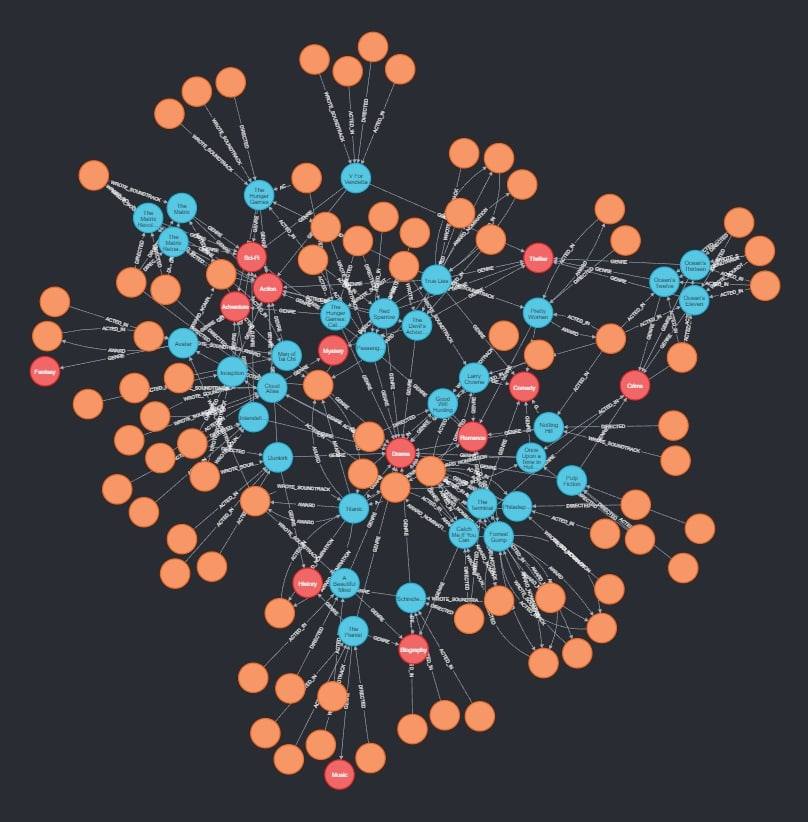

== Neo4j

.Graph representation of database in Neo4j

.Create script
[%collapsible]
====
[source, cypher]
----
//genres
CREATE (drama:Genre {name:'Drama'})
CREATE (romance:Genre {name:'Romance'})
CREATE (biography:Genre {name:'Biography'})
CREATE (crime:Genre {name:'Crime'})
CREATE (action:Genre {name:'Action'})
CREATE (adventure:Genre {name:'Adventure'})
CREATE (fantasy:Genre {name:'Fantasy'})
CREATE (comedy:Genre {name:'Comedy'})
CREATE (scifi:Genre {name:'Sci-Fi'})
CREATE (history:Genre {name:'History'})
CREATE (thriller:Genre {name:'Thriller'})
CREATE (mystery:Genre {name:'Mystery'})
CREATE (music:Genre {name:'Music'})

// actors
CREATE (TomHanks:Person {firstName:'Tom', lastName:'Hanks', born:1956, country:'USA'})
CREATE (GarySinise:Person {firstName:'Gary', lastName:'Sinise', born:1955, country:'USA'})
CREATE (DenzelWashington:Person {firstName:'Denzel', lastName:'Washington', born:1954, country:'USA'})
CREATE (LeonardoDiCaprio:Person {firstName:'Leonardo', lastName:'DiCaprio', born:1974, country:'USA'})
CREATE (CatherineZetaJones:Person {firstName:'CatherineZeta', lastName:'Jones', born:1969, country:'UK'})
CREATE (KateWinslet:Person {firstName:'Kate', lastName:'Winslet', born:1975, country:'UK'})
CREATE (SamWorthington:Person {firstName:'Sam', lastName:'Worthington', born:1976, country:'UK'})
CREATE (ZoeSaldana:Person {firstName:'Zoe', lastName:'Saldana', born:1978, country:'USA'})
CREATE (ArnoldSchwarzenegger:Person {firstName:'Arnold', lastName:'Schwarzenegger', born:1947, country:'Austria'})
CREATE (JamieLeeCurtis:Person {firstName:'Jamie Lee', lastName:'Curtis', born:1958, country:'USA'})
CREATE (ElliotPage:Person {firstName:'Elliot', lastName:'Page', born:1987, country:'Canada'})
CREATE (BradPitt:Person {firstName:'Brad', lastName:'Pitt', born:1963, country:'USA'})
CREATE (MatthewMcConaughey:Person {firstName:'Matthew', lastName:'McConaughey', born:1969, country:'USA'})
CREATE (AnneHathaway:Person {firstName:'Anne', lastName:'Hathaway', born:1982, country:'USA'})
CREATE (FionnWhitehead:Person {firstName:'Fionn', lastName:'Whitehead', born:1997, country:'USA'})
CREATE (TomHardy:Person {firstName:'Tom', lastName:'Hardy', born:1977, country:'UK'})
CREATE (CillianMurphy:Person {firstName:'Cillian', lastName:'Murphy', born:1976, country:'Ireland'})
CREATE (RobinWiliams:Person {firstName:'Robin', lastName:'Wiliams', born:1951, country:'USA'})
CREATE (BenAffleck:Person {firstName:'Ben', lastName:'Affleck', born:1972, country:'USA'})
CREATE (RussellCrowe:Person {firstName:'Russell', lastName:'Crowe', born:1964, country:'USA'})
CREATE (JenniferConnelly:Person {firstName:'Jennifer', lastName:'Connelly', born:1970, country:'USA'})
CREATE (LiamNeeson:Person {firstName:'Liam', lastName:'Neeson', born:1951, country:'UK'})
CREATE (RalphFiennes:Person {firstName:'Ralph', lastName:'Fiennes', born:1962, country:'UK'})
CREATE (BenKingsley:Person {firstName:'Ben', lastName:'Kingsley', born:1943, country:'UK'})
CREATE (GeorgeClooney:Person {firstName:'George', lastName:'Clooney', born:1961, country:'USA'})
CREATE (JuliaRoberts:Person {firstName:'Julia', lastName:'Roberts', born:1967, country:'USA'})
CREATE (KeanuReeves:Person {firstName:'Keanu', lastName:'Reeves', born:1964, country:'Lebanon'})
CREATE (ChrisPratt:Person {firstName:'Chris', lastName:'Pratt', born:1979, country:'USA'})
CREATE (JenniferLawrence:Person {firstName:'Jennifer', lastName:'Lawrence', born:1990, country:'USA'})
CREATE (LiamHemsworth:Person {firstName:'Liam', lastName:'Hemsworth', born:1990, country:'Australia'})
CREATE (NataliePortman:Person {firstName:'Natalie', lastName:'Portman', born:1981, country:'Israel'})
CREATE (HugoWeaving:Person {firstName:'Hugo', lastName:'Weaving', born:1960, country:'Nigeria'})
CREATE (HalleBerry:Person {firstName:'Halle', lastName:'Berry', born:1966, country:'USA'})
CREATE (RichardGere:Person {firstName:'Richard', lastName:'Gere', born:1949, country:'USA'})
CREATE (AdrienBrody:Person {firstName:'Adrien', lastName:'Brody', born:1973, country:'USA'})
CREATE (EmiliaFox:Person {firstName:'Emilia', lastName:'Fox', born:1974, country:'USA'})
CREATE (AlPacino:Person {firstName:'Al', lastName:'Pacino', born:1940, country:'USA'})
CREATE (JohnTravolta:Person {firstName:'John', lastName:'Travolta', born:1954, country:'USA'})
CREATE (SamuelLJackson:Person {firstName:'Samuel L.', lastName:'Jackson', born:1948, country:'USA'})
CREATE (TigerChenHu:Person {firstName:'Tiger Chen', lastName:'Hu', born:1975, country:'China'})

// soundtrack writers
CREATE (AlanSilvestri:Person {firstName:'Alan', lastName:'Silvestri', born:1950, country:'USA'})
CREATE (HowardShore:Person {firstName:'Howard', lastName:'Shore', born:1946, country:'Canada'})
CREATE (JohnWiliams:Person {firstName:'John', lastName:'Wiliams', born:1932, country:'USA'})
CREATE (JamesHorner:Person {firstName:'James', lastName:'Horner', born:1953, country:'USA'})
CREATE (BradFiedel:Person {firstName:'Brad', lastName:'Fiedel', born:1951, country:'USA'})
CREATE (HansZimmer:Person {firstName:'Hans', lastName:'Zimmer', born:1957, country:'Germany'})
CREATE (DannyElfman:Person {firstName:'Danny', lastName:'Elfman', born:1953, country:'USA'})
CREATE (DavidHolmes:Person {firstName:'David', lastName:'Holmes', born:1971, country:'USA'})
CREATE (DonDavis:Person {firstName:'Don', lastName:'Davis', born:1965, country:'USA'})
CREATE (ThomasNewman:Person {firstName:'Thomas', lastName:'Newman', born:1955, country:'USA'})
CREATE (JamesNewtonHoward:Person {firstName:'James Newton', lastName:'Howard', born:1951, country:'USA'})
CREATE (TBoneBurnett:Person {firstName:'T Bone', lastName:'Burnett', born:1948, country:'USA'})
CREATE (JoBlankenburg:Person {firstName:'Jo', lastName:'Blankenburg', born:1972, country:'Germany'})
CREATE (DarioMarianelli:Person {firstName:'Dario', lastName:'Marianelli', born:1963, country:'Italy'})
CREATE (TomTykwer:Person {firstName:'Tom', lastName:'Tykwer', born:1965, country:'Germany'})
CREATE (JohnnyKlimek:Person {firstName:'Johnny', lastName:'Klimek', born:1962, country:'Australia'})
CREATE (ReinholdHeil:Person {firstName:'Reinhold', lastName:'Heil', born:1954, country:'Germany'})
CREATE (TrevorJones:Person {firstName:'Trevor', lastName:'Jones', born:1949, country:'South Africa'})
CREATE (WojciechKilar:Person {firstName:'Wojciech', lastName:'Kilar', born:1932, country:'Ukraine'})
CREATE (KwongWingChan:Person {firstName:'Kwong-Wing', lastName:'Chan', born:1967, country:'Hong Kong'})

// directors
CREATE (RobertZemeckis:Person {firstName:'Robert', lastName:'Zemeckis', born:1951, country:'USA'})
CREATE (JonathanDemme:Person {firstName:'Jonathan', lastName:'Demme', born:1944, country:'USA'})
CREATE (StevenSpielberg:Person {firstName:'Steven', lastName:'Spielberg', born:1946, country:'USA'})
CREATE (JamesCameron:Person {firstName:'James', lastName:'Cameron', born:1954, country:'Canada'})
CREATE (ChristopherNolan:Person {firstName:'Christopher', lastName:'Nolan', born:1970, country:'UK'})
CREATE (QuentinTarantino:Person {firstName:'Quentin', lastName:'Tarantino', born:1963, country:'USA'})
CREATE (GusVanSant:Person {firstName:'Gus Van', lastName:'Sant', born:1952, country:'USA'})
CREATE (RonHoward:Person {firstName:'Ron', lastName:'Howard', born:1954, country:'USA'})
CREATE (StevenSoderbergh:Person {firstName:'Steven', lastName:'Soderbergh', born:1963, country:'USA'})
CREATE (MortenTyldum:Person {firstName:'Morten', lastName:'Tyldum', born:1967, country:'Norway'})
CREATE (LillyWachowski:Person {firstName:'Lilly', lastName:'Wachowski', born:1967, country:'USA'})
CREATE (LanaWachowski:Person {firstName:'Lana', lastName:'Wachowski', born:1965, country:'USA'})
CREATE (GaryRose:Person {firstName:'Gary', lastName:'Rose', born:1956, country:'USA'})
CREATE (FrancisLawrence:Person {firstName:'Francis', lastName:'Lawrence', born:1971, country:'Austria'})
CREATE (JamesMcTeigue:Person {firstName:'James', lastName:'McTeigue', born:1967, country:'Australia'})
CREATE (GaryMarshall:Person {firstName:'Gary', lastName:'Marshall', born:1934, country:'USA'})
CREATE (RogerMichell:Person {firstName:'Roger', lastName:'Michell', born:1956, country:'South Africa'})
CREATE (RomanPolanski:Person {firstName:'Roman', lastName:'Polanski', born:1933, country:'France'})
CREATE (TaylorHackford:Person {firstName:'Taylor', lastName:'Hackford', born:1944, country:'USA'})

// movies
CREATE (ForrestGump:Movie {title: 'Forrest Gump', year:1994, length: 142})
CREATE
(RobertZemeckis)-[:DIRECTED]->(ForrestGump),
(AlanSilvestri)-[:WROTE_SOUNDTRACK]->(ForrestGump),
(TomHanks)-[:ACTED_IN {role:'Forrest Gump'}]->(ForrestGump),
(GarySinise)-[:ACTED_IN {role:'Lieutenant Dan Taylor'}]->(ForrestGump),
(ForrestGump)-[:GENRE]->(drama),
(ForrestGump)-[:GENRE]->(romance),
(ForrestGump)-[:AWARD {category:'Oscar', name:'Best Actor in Leading Role'}]->(TomHanks),
(ForrestGump)-[:AWARD_NOMINATION {category:'The Saturn Awards', name:'Best Actor'}]->(TomHanks),
(ForrestGump)-[:AWARD {category:'Golden Globes', name:'Best Actor - Drama'}]->(TomHanks),
(ForrestGump)-[:AWARD {category:'Oscar', name:'Best Director'}]->(RobertZemeckis),
(ForrestGump)-[:AWARD_NOMINATION {category:'The Saturn Awards', name:'Best Director'}]->(RobertZemeckis),
(ForrestGump)-[:AWARD {category:'Golden Globes', name:'Best Director'}]->(RobertZemeckis),
(ForrestGump)-[:AWARD_NOMINATION {category:'Oscar', name:'Best Actor in Supporting Role'}]->(GarySinise),
(ForrestGump)-[:AWARD {category:'The Saturn Awards', name:'Best Supporting Actor'}]->(GarySinise),
(ForrestGump)-[:AWARD_NOMINATION {category:'Golden Globes', name:'Best Actor in Supporting Role'}]->(GarySinise),
(ForrestGump)-[:AWARD_NOMINATION {category:'Oscar', name:'Best Music'}]->(AlanSilvestri)

CREATE (Philadephia:Movie {title: 'Philadephia', year:1993, length: 125})
CREATE
(JonathanDemme)-[:DIRECTED]->(Philadephia),
(HowardShore)-[:WROTE_SOUNDTRACK]->(Philadephia),
(TomHanks)-[:ACTED_IN]->(Philadephia),
(DenzelWashington)-[:ACTED_IN]->(Philadephia),
(Philadephia)-[:GENRE]->(drama),
(Philadephia)-[:AWARD {category:'Golden Globes', name:'Best Actor - Drama'}]->(TomHanks),
(Philadephia)-[:AWARD {category:'Oscar', name:'Best Actor in Leading Role'}]->(TomHanks)

CREATE (CatchMeIfYouCan:Movie {title: 'Catch Me If You Can', year:2002, length: 141})
CREATE
(StevenSpielberg)-[:DIRECTED]->(CatchMeIfYouCan),
(JohnWiliams)-[:WROTE_SOUNDTRACK]->(CatchMeIfYouCan),
(LeonardoDiCaprio)-[:ACTED_IN]->(CatchMeIfYouCan),
(TomHanks)-[:ACTED_IN]->(CatchMeIfYouCan),
(CatchMeIfYouCan)-[:GENRE]->(drama),
(CatchMeIfYouCan)-[:GENRE]->(biography),
(CatchMeIfYouCan)-[:GENRE]->(crime),
(CatchMeIfYouCan)-[:AWARD_NOMINATION {category:'Oscar', name:'Best Music'}]->(JohnWiliams),
(CatchMeIfYouCan)-[:AWARD_NOMINATION {category:'Golden Globes', name:'Best Actor - Drama'}]->(LeonardoDiCaprio)

CREATE (TheTerminal:Movie {title: 'The Terminal', year:2004, length: 128})
CREATE
(StevenSpielberg)-[:DIRECTED]->(TheTerminal),
(JohnWiliams)-[:WROTE_SOUNDTRACK]->(TheTerminal),
(TomHanks)-[:ACTED_IN]->(TheTerminal),
(CatherineZetaJones)-[:ACTED_IN]->(TheTerminal),
(TheTerminal)-[:GENRE]->(drama),
(TheTerminal)-[:GENRE]->(romance),
(TheTerminal)-[:GENRE]->(comedy)

CREATE (Titanic:Movie {title: 'Titanic', year:1997, length: 194})
CREATE
(JamesCameron)-[:DIRECTED]->(Titanic),
(JamesHorner)-[:WROTE_SOUNDTRACK]->(Titanic),
(LeonardoDiCaprio)-[:ACTED_IN {role: 'Jack Dawson'}]->(Titanic),
(KateWinslet)-[:ACTED_IN {role: 'Rose DeWitt Bukater'}]->(Titanic),
(Titanic)-[:GENRE]->(drama),
(Titanic)-[:GENRE]->(romance),
(Titanic)-[:AWARD_NOMINATION {category:'Golden Globes', name:'Best Actor - Comedy or Musical'}]->(LeonardoDiCaprio),
(Titanic)-[:AWARD {category:'Oscar', name:'Best Director'}]->(JamesCameron),
(Titanic)-[:AWARD {category:'Golden Globes', name:'Best Director'}]->(JamesCameron),
(Titanic)-[:AWARD {category:'Oscar', name:'Best Music'}]->(JamesHorner),
(Titanic)-[:AWARD {category:'Golden Globes', name:'Best Original Song'}]->(JamesHorner),
(Titanic)-[:AWARD_NOMINATION {category:'Oscar', name:'Best Actress in Leading Role'}]->(KateWinslet),
(Titanic)-[:AWARD_NOMINATION {category:'Golden Globes', name:'Best Actress - Drama'}]->(KateWinslet)

CREATE (Avatar:Movie {title: 'Avatar', year:2009, length: 164})
CREATE
(JamesCameron)-[:DIRECTED]->(Avatar),
(JamesHorner)-[:WROTE_SOUNDTRACK]->(Avatar),
(SamWorthington)-[:ACTED_IN {role: 'Jake Sully'}]->(Avatar),
(ZoeSaldana)-[:ACTED_IN {role: 'Neytiri'}]->(Avatar),
(Avatar)-[:GENRE]->(action),
(Avatar)-[:GENRE]->(adventure),
(Avatar)-[:GENRE]->(fantasy),
(Avatar)-[:AWARD {category:'The Saturn Awards', name:'Best Actor'}]->(SamWorthington),
(Avatar)-[:AWARD {category:'Golden Globes', name:'Best Director'}]->(JamesCameron)

CREATE (TrueLies:Movie {title: 'True Lies', year:1994, length: 135})
CREATE
(JamesCameron)-[:DIRECTED]->(TrueLies),
(BradFiedel)-[:WROTE_SOUNDTRACK]->(TrueLies),
(ArnoldSchwarzenegger)-[:ACTED_IN]->(TrueLies),
(JamieLeeCurtis)-[:ACTED_IN]->(TrueLies),
(TrueLies)-[:GENRE]->(action),
(TrueLies)-[:GENRE]->(comedy),
(TrueLies)-[:GENRE]->(thriller),
(TrueLies)-[:AWARD {category:'Golden Globes', name:'Best Actress - Comedy or Musical'}]->(JamieLeeCurtis),
(TrueLies)-[:AWARD {category:'The Saturn Awards', name:'Best Actress'}]->(JamieLeeCurtis),
(TrueLies)-[:AWARD {category:'The Saturn Awards', name:'Best Director'}]->(JamesCameron),
(TrueLies)-[:AWARD_NOMINATION {category:'The Saturn Awards', name:'Best Actor'}]->(ArnoldSchwarzenegger)

CREATE (Inception:Movie {title: 'Inception', year:2010, length: 148})
CREATE
(ChristopherNolan)-[:DIRECTED]->(Inception),
(HansZimmer)-[:WROTE_SOUNDTRACK]->(Inception),
(LeonardoDiCaprio)-[:ACTED_IN]->(Inception),
(ElliotPage)-[:ACTED_IN]->(Inception),
(Inception)-[:GENRE]->(action),
(Inception)-[:GENRE]->(adventure),
(Inception)-[:GENRE]->(scifi)

CREATE (OnceUponATimeInHollywood:Movie {title: 'Once Upon a Time in Hollywood', year:2019, length: 161})
CREATE
(QuentinTarantino)-[:DIRECTED]->(OnceUponATimeInHollywood),
(LeonardoDiCaprio)-[:ACTED_IN]->(OnceUponATimeInHollywood),
(BradPitt)-[:ACTED_IN]->(OnceUponATimeInHollywood),
(OnceUponATimeInHollywood)-[:GENRE]->(drama),
(OnceUponATimeInHollywood)-[:GENRE]->(comedy),
(OnceUponATimeInHollywood)-[:AWARD_NOMINATION {category:'Golden Globes', name:'Best Actor - Drama'}]->(LeonardoDiCaprio)

CREATE (Interstellar:Movie {title: 'Interstellar', year:2014, length: 169})
CREATE
(ChristopherNolan)-[:DIRECTED]->(Interstellar),
(HansZimmer)-[:WROTE_SOUNDTRACK]->(Interstellar),
(MatthewMcConaughey)-[:ACTED_IN]->(Interstellar),
(AnneHathaway)-[:ACTED_IN]->(Interstellar),
(Interstellar)-[:GENRE]->(drama),
(Interstellar)-[:GENRE]->(adventure),
(Interstellar)-[:GENRE]->(scifi)

CREATE (Dunkirk:Movie {title: 'Dunkirk', year:2017, length: 106})
CREATE
(ChristopherNolan)-[:DIRECTED]->(Dunkirk),
(HansZimmer)-[:WROTE_SOUNDTRACK]->(Dunkirk),
(FionnWhitehead)-[:ACTED_IN]->(Dunkirk),
(TomHardy)-[:ACTED_IN]->(Dunkirk),
(CillianMurphy)-[:ACTED_IN]->(Dunkirk),
(Dunkirk)-[:GENRE]->(drama),
(Dunkirk)-[:GENRE]->(action),
(Dunkirk)-[:GENRE]->(history)

CREATE (GoodWillHunting:Movie {title: 'Good Will Hunting', year:1997, length: 126})
CREATE
(GusVanSant)-[:DIRECTED]->(GoodWillHunting),
(DannyElfman)-[:WROTE_SOUNDTRACK]->(GoodWillHunting),
(RobinWiliams)-[:ACTED_IN]->(GoodWillHunting),
(BenAffleck)-[:ACTED_IN]->(GoodWillHunting),
(GoodWillHunting)-[:GENRE]->(drama),
(GoodWillHunting)-[:GENRE]->(romance)

CREATE (ABeautifulMind:Movie {title: 'A Beautiful Mind', year:2001, length: 135})
CREATE
(RonHoward)-[:DIRECTED]->(ABeautifulMind),
(JamesHorner)-[:WROTE_SOUNDTRACK]->(ABeautifulMind),
(RussellCrowe)-[:ACTED_IN]->(ABeautifulMind),
(JenniferConnelly)-[:ACTED_IN]->(ABeautifulMind),
(ABeautifulMind)-[:GENRE]->(drama),
(ABeautifulMind)-[:GENRE]->(biography)

CREATE (SchindlersList:Movie {title: "Schindler's List", year:1993, length: 195})
CREATE
(StevenSpielberg)-[:DIRECTED]->(SchindlersList),
(JohnWiliams)-[:WROTE_SOUNDTRACK]->(SchindlersList),
(LiamNeeson)-[:ACTED_IN]->(SchindlersList),
(RalphFiennes)-[:ACTED_IN]->(SchindlersList),
(BenKingsley)-[:ACTED_IN]->(SchindlersList),
(SchindlersList)-[:GENRE]->(drama),
(SchindlersList)-[:GENRE]->(biography),
(SchindlersList)-[:GENRE]->(history)

CREATE (OceansEleven:Movie {title: "Ocean's Eleven", year:2001, length: 116})
CREATE
(StevenSoderbergh)-[:DIRECTED]->(OceansEleven),
(DavidHolmes)-[:WROTE_SOUNDTRACK]->(OceansEleven),
(GeorgeClooney)-[:ACTED_IN]->(OceansEleven),
(JuliaRoberts)-[:ACTED_IN]->(OceansEleven),
(BradPitt)-[:ACTED_IN]->(OceansEleven),
(OceansEleven)-[:GENRE]->(crime),
(OceansEleven)-[:GENRE]->(thriller)

CREATE (OceansTwelve:Movie {title: "Ocean's Twelve", year:2004, length: 121})
CREATE
(StevenSoderbergh)-[:DIRECTED]->(OceansTwelve),
(DavidHolmes)-[:WROTE_SOUNDTRACK]->(OceansTwelve),
(GeorgeClooney)-[:ACTED_IN]->(OceansTwelve),
(JuliaRoberts)-[:ACTED_IN]->(OceansTwelve),
(BradPitt)-[:ACTED_IN]->(OceansTwelve),
(OceansTwelve)-[:GENRE]->(crime),
(OceansTwelve)-[:GENRE]->(thriller)

CREATE (OceansThirteen:Movie {title: "Ocean's Thirteen", year:2007, length: 122})
CREATE
(StevenSoderbergh)-[:DIRECTED]->(OceansThirteen),
(DavidHolmes)-[:WROTE_SOUNDTRACK]->(OceansThirteen),
(GeorgeClooney)-[:ACTED_IN]->(OceansThirteen),
(BradPitt)-[:ACTED_IN]->(OceansThirteen),
(OceansThirteen)-[:GENRE]->(crime),
(OceansThirteen)-[:GENRE]->(thriller)

CREATE (TheMatrix:Movie {title: 'The Matrix', year:1996, length: 136})
CREATE
(LillyWachowski)-[:DIRECTED]->(TheMatrix),
(LanaWachowski)-[:DIRECTED]->(TheMatrix),
(DonDavis)-[:WROTE_SOUNDTRACK]->(TheMatrix),
(KeanuReeves)-[:ACTED_IN {role: 'Neo'}]->(TheMatrix),
(TheMatrix)-[:GENRE]->(action),
(TheMatrix)-[:GENRE]->(scifi),
(TheMatrix)-[:AWARD_NOMINATION {category:'The Saturn Awards', name:'Best Actor'}]->(KeanuReeves)

CREATE (TheMatrixRevolutions:Movie {title: 'The Matrix Revolutions', year:2003, length: 129})
CREATE
(LillyWachowski)-[:DIRECTED]->(TheMatrixRevolutions),
(LanaWachowski)-[:DIRECTED]->(TheMatrixRevolutions),
(DonDavis)-[:WROTE_SOUNDTRACK]->(TheMatrixRevolutions),
(KeanuReeves)-[:ACTED_IN {role: 'Neo'}]->(TheMatrixRevolutions),
(TheMatrixRevolutions)-[:GENRE]->(action),
(TheMatrixRevolutions)-[:GENRE]->(scifi)

CREATE (TheMatrixReloaded:Movie {title: 'The Matrix Reloaded', year:2003, length: 138})
CREATE
(LillyWachowski)-[:DIRECTED]->(TheMatrixReloaded),
(LanaWachowski)-[:DIRECTED]->(TheMatrixReloaded),
(DonDavis)-[:WROTE_SOUNDTRACK]->(TheMatrixReloaded),
(KeanuReeves)-[:ACTED_IN {role: 'Neo'}]->(TheMatrixReloaded),
(TheMatrixReloaded)-[:GENRE]->(action),
(TheMatrixReloaded)-[:GENRE]->(scifi)

CREATE (Passengers:Movie {title: 'Passengers', year:2016, length: 116})
CREATE
(MortenTyldum)-[:DIRECTED]->(Passengers),
(ThomasNewman)-[:WROTE_SOUNDTRACK]->(Passengers),
(ChrisPratt)-[:ACTED_IN]->(Passengers),
(JenniferLawrence)-[:ACTED_IN]->(Passengers),
(Passengers)-[:GENRE]->(drama),
(Passengers)-[:GENRE]->(romance),
(Passengers)-[:GENRE]->(scifi)

CREATE (TheHungerGames:Movie {title: 'The Hunger Games', year:2012, length: 144})
CREATE
(GaryRose)-[:DIRECTED]->(TheHungerGames),
(JamesNewtonHoward)-[:WROTE_SOUNDTRACK]->(TheHungerGames),
(TBoneBurnett)-[:WROTE_SOUNDTRACK]->(TheHungerGames),
(JoBlankenburg)-[:WROTE_SOUNDTRACK]->(TheHungerGames),
(JenniferLawrence)-[:ACTED_IN {role: 'Katniss Everdeen'}]->(TheHungerGames),
(LiamHemsworth)-[:ACTED_IN {role: 'Gale Hawthorne'}]->(TheHungerGames),
(TheHungerGames)-[:GENRE]->(action),
(TheHungerGames)-[:GENRE]->(adventure),
(TheHungerGames)-[:GENRE]->(scifi)

CREATE (TheHungerGamesCatchingFire:Movie {title: 'The Hunger Games: Catching Fire', year:2013, length: 146})
CREATE
(FrancisLawrence)-[:DIRECTED]->(TheHungerGamesCatchingFire),
(JamesNewtonHoward)-[:WROTE_SOUNDTRACK]->(TheHungerGamesCatchingFire),
(JenniferLawrence)-[:ACTED_IN {role: 'Katniss Everdeen'}]->(TheHungerGamesCatchingFire),
(LiamHemsworth)-[:ACTED_IN {role: 'Gale Hawthorne'}]->(TheHungerGamesCatchingFire),
(TheHungerGamesCatchingFire)-[:GENRE]->(drama),
(TheHungerGamesCatchingFire)-[:GENRE]->(adventure),
(TheHungerGamesCatchingFire)-[:GENRE]->(action)

CREATE (RedSparrow:Movie {title: 'Red Sparrow', year:2018, length: 140})
CREATE
(FrancisLawrence)-[:DIRECTED]->(RedSparrow),
(JamesNewtonHoward)-[:WROTE_SOUNDTRACK]->(RedSparrow),
(JenniferLawrence)-[:ACTED_IN]->(RedSparrow),
(RedSparrow)-[:GENRE]->(drama),
(RedSparrow)-[:GENRE]->(action),
(RedSparrow)-[:GENRE]->(thriller)

CREATE (VForVendetta:Movie {title: 'V For Vendetta', year:2005, length: 132})
CREATE
(JamesMcTeigue)-[:DIRECTED]->(VForVendetta),
(DarioMarianelli)-[:WROTE_SOUNDTRACK]->(VForVendetta),
(NataliePortman)-[:ACTED_IN]->(VForVendetta),
(HugoWeaving)-[:ACTED_IN]->(VForVendetta),
(VForVendetta)-[:GENRE]->(action),
(VForVendetta)-[:GENRE]->(scifi),
(VForVendetta)-[:GENRE]->(thriller)

CREATE (CloudAtlas:Movie {title: 'Cloud Atlas', year:2012, length: 165})
CREATE
(LanaWachowski)-[:DIRECTED]->(CloudAtlas),
(TomTykwer)-[:DIRECTED]->(CloudAtlas),
(LillyWachowski)-[:DIRECTED]->(CloudAtlas),
(TomTykwer)-[:WROTE_SOUNDTRACK]->(CloudAtlas),
(JohnnyKlimek)-[:WROTE_SOUNDTRACK]->(CloudAtlas),
(ReinholdHeil)-[:WROTE_SOUNDTRACK]->(CloudAtlas),
(TomHanks)-[:ACTED_IN]->(CloudAtlas),
(HalleBerry)-[:ACTED_IN]->(CloudAtlas),
(CloudAtlas)-[:GENRE]->(drama),
(CloudAtlas)-[:GENRE]->(action),
(CloudAtlas)-[:GENRE]->(mystery)

CREATE (PrettyWoman:Movie {title: 'Pretty Woman', year:1990, length: 119})
CREATE
(GaryMarshall)-[:DIRECTED]->(PrettyWoman),
(JamesNewtonHoward)-[:WROTE_SOUNDTRACK]->(PrettyWoman),
(RichardGere)-[:ACTED_IN]->(PrettyWoman),
(JuliaRoberts)-[:ACTED_IN]->(PrettyWoman),
(PrettyWoman)-[:GENRE]->(romance),
(PrettyWoman)-[:GENRE]->(comedy),
(PrettyWoman)-[:AWARD {category:'Golden Globes', name:'Best Actor - Comedy or Musical'}]->(RichardGere),
(PrettyWoman)-[:AWARD {category:'Golden Globes', name:'Best Actress - Comedy or Musical'}]->(JuliaRoberts)

CREATE (NottingHill:Movie {title: 'Notting Hill', year:1999, length: 124})
CREATE
(RogerMichell)-[:DIRECTED]->(NottingHill),
(TrevorJones)-[:WROTE_SOUNDTRACK]->(NottingHill),
(JuliaRoberts)-[:ACTED_IN]->(NottingHill),
(NottingHill)-[:GENRE]->(drama),
(NottingHill)-[:GENRE]->(romance),
(NottingHill)-[:GENRE]->(comedy)

CREATE (ThePianist:Movie {title: 'The Pianist', year:2002, length: 150})
CREATE
(RomanPolanski)-[:DIRECTED]->(ThePianist),
(WojciechKilar)-[:WROTE_SOUNDTRACK]->(ThePianist),
(AdrienBrody)-[:ACTED_IN]->(ThePianist),
(EmiliaFox)-[:ACTED_IN]->(ThePianist),
(ThePianist)-[:GENRE]->(drama),
(ThePianist)-[:GENRE]->(biography),
(ThePianist)-[:GENRE]->(music),
(ThePianist)-[:GENRE]->(history)

CREATE (TheDevilsAdvocate:Movie {title: "The Devil's Advocate", year:1997, length: 144})
CREATE
(TaylorHackford)-[:DIRECTED]->(TheDevilsAdvocate),
(JamesNewtonHoward)-[:WROTE_SOUNDTRACK]->(TheDevilsAdvocate),
(KeanuReeves)-[:ACTED_IN]->(TheDevilsAdvocate),
(AlPacino)-[:ACTED_IN]->(TheDevilsAdvocate),
(TheDevilsAdvocate)-[:GENRE]->(drama),
(TheDevilsAdvocate)-[:GENRE]->(mystery),
(TheDevilsAdvocate)-[:GENRE]->(thriller)

CREATE (PulpFiction:Movie {title: 'Pulp Fiction', year:1994, length: 154})
CREATE
(QuentinTarantino)-[:DIRECTED]->(PulpFiction),
(JohnTravolta)-[:ACTED_IN]->(PulpFiction),
(SamuelLJackson)-[:ACTED_IN]->(PulpFiction),
(PulpFiction)-[:GENRE]->(drama),
(PulpFiction)-[:GENRE]->(crime)

CREATE (ManOfTaiChi:Movie {title: 'Man of Tai Chi', year:2013, length: 105})
CREATE
(KeanuReeves)-[:DIRECTED]->(ManOfTaiChi),
(KwongWingChan)-[:WROTE_SOUNDTRACK]->(ManOfTaiChi),
(TigerChenHu)-[:ACTED_IN]->(ManOfTaiChi),
(KeanuReeves)-[:ACTED_IN]->(ManOfTaiChi),
(ManOfTaiChi)-[:GENRE]->(drama),
(ManOfTaiChi)-[:GENRE]->(action)

CREATE (LarryCrowne:Movie {title: 'Larry Crowne', year:2011, length: 94})
CREATE
(TomHanks)-[:DIRECTED]->(LarryCrowne),
(JamesNewtonHoward)-[:WROTE_SOUNDTRACK]->(LarryCrowne),
(TomHanks)-[:ACTED_IN]->(LarryCrowne),
(JuliaRoberts)-[:ACTED_IN]->(LarryCrowne),
(LarryCrowne)-[:GENRE]->(drama),
(LarryCrowne)-[:GENRE]->(comedy),
(LarryCrowne)-[:GENRE]->(romance)
----
====

=== 1. Find movies with the title "Passengers". Return movie titles and years.

We are asked to find an exact match,
so we ask for the property in the node.

[source, cypher]
----
MATCH (m:Movie {title: 'Passengers'})
RETURN m.title, m.year
----

=== 2. Find movies with "The" contained in the title. Return movie titles and years.

We are asked to find the word "The" contained in the movie title.
Because of that,
we cannot use simple equality
and we are forced to use `CONTAINS` within `WHERE`.

[source, cypher]
----
MATCH (m:Movie)
WHERE m.title CONTAINS 'The'
RETURN m.title, m.year
----

=== 3. Find movies directed by James Cameron. Return movie titles together with all the actor full names (merged first and last names) that acted in those movies.

We are asked to find all actors of James Cameron directed movies.
First, we need to find his movies.
Second, we need to find actors from these movies.
Then, we need to concat ``firstName``s and ``lastName``s and save it as `fullName`. 

[source, cypher]
----
MATCH (d:Person {firstName: 'James', lastName: 'Cameron'})-[:DIRECTED]-(m:Movie)-[:ACTED_IN]-(a:Person)
RETURN m.title, a.firstName + ' ' + a.lastName as fullName
----

=== 4. Find movies with connection (actor, director, soundtrack writer, …) to some person from Germany. Return movie titles and years together with all person first and last names, sorted by movie title, ascending, and then last name, descending.

We are asked to find movies,
that were directed,
acted in or wrote a soundtrack by someone from Germany.
First, we find those people from Germany
by selecting theirs country property.
Then we use generic direct connection from person to a movie
(-->, because otherwise it might duplicate values from awards etc. connections)
and return the specified values,
ordered by `title` and `lastName`.

[source, cypher]
----
MATCH (s:Person {country: 'Germany'})-->(m:Movie)
RETURN m.title, m.year, s.firstName, s.lastName
ORDER BY m.title ASC, s.lastName DESC
----

=== 5. Find movie titles in which Al Pacino or Julia Roberts acted in.

First, we need to match generic actor to movie relation.
Then, we need to set the conditions in the `WHERE` clause to match specified actors.
And return `DISTINCT` ``title``s, so the ``title``s do not repeat.

[source, cypher]
----
MATCH (a:Person)-[:ACTED_IN]->(m:Movie)
WHERE (a.firstName = 'Al' and a.lastName = 'Pacino') or (a.firstName = 'Julia' and a.lastName = 'Robert')
RETURN DISTINCT m.title
----

=== 6. Find movie titles in which Tom Hanks has some connection to it (with excluded acted in connection).

This task is a bit tricky.
Tom Hanks directed the movie Larry Crowne, but also played in it.
That means we cannot use a query like this one below,
where we remove all movies with `:ACTED_IN` relations,
because that would also remove the movie Larry Crowne.

[source, cypher]
----
MATCH (th:Person {firstName: 'Tom', lastName: 'Hanks'})-->(m:Movie)
WHERE NOT EXISTS {
    MATCH (th)-[:ACTED_IN]->(m)
}
RETURN m.title
----

Creation of a generic query to cover our case is probably not supported,
therefore we will explicitly allowlist the 2 possible relation types.

[source, cypher]
----
MATCH (th:Person {firstName: 'Tom', lastName: 'Hanks'})-[:DIRECTED | :WROTE_SOUNDTRACK]->(m:Movie)
RETURN m.title
----

=== 7. Find movies where at least one actor played.

Simple.
We just MATCH movies using :ACTED_IN relation.

[source, cypher]
----
MATCH (a:Person)-[:ACTED_IN]->(m:Movie)
RETURN DISTINCT m.title
----

=== 8. Find movies with most people with awards and award nominations. Return movie titles, count of awards and count of award nominations, sorted in descending order by award counts. Display only movies that have at least 1 award or nomination.

We were asked to find award and award nominations counts for each movie.
First, we match every movie and using `WITH` clause
we add a list of awards and nominations to it.
Then we filtered movies with at least 1 award or nomination.
And finally,
we returned the counts in descending order by awards count.

[source, cypher]
----
MATCH (m:Movie)
WITH m,
     [(m)-[:AWARD]->(a:Person) | a] as awards,
     [(m)-[:AWARD_NOMINATION]->(a:Person) | a] as nominations
WITH m,
     size(awards) as awardsCount,
     size(nominations) as nominationsCount
WHERE awardsCount > 0 or nominationsCount > 0
RETURN m.title, awardsCount, nominationsCount
ORDER BY awardsCount DESC
----

=== 9. Find people that acted in any movie (aka actors). Return person first and last names and years of birth ordered by the year, last name, first name, each in ascending order. Limit the output to 10 results.

We are asked to find all people that played in a movie and return their properties.
First we match a person nodes and in the WHERE EXISTS clause we filder people that have `:ACTED_IN` relation with some movie.
We do it this way (in `WHERE` clause, not in `MATCH` clause), so we filter duplicates which would be caused if we used multiple records of movies for a given actor.
And finally, we return the data in required order.

[source, cypher]
----
MATCH (a:Person)
WHERE EXISTS {
    (a)-[:ACTED_IN]->(:Movie)
}
RETURN a.firstName, a.lastName, a.born
ORDER BY a.born ASC,
         a.lastName ASC,
         a.firstName ASC
LIMIT 10
----

=== 10. Count people by country of origin. Return country name and the count, ordered by the count value.

First, we need to select all people.
Then we combine `COLLECT` with array creation,
which will create pairs of code and array with countries repeating itself, which we count using `size()`.
And finally,
we return the country code and its count in descending order.

[source, cypher]
----
MATCH (p:Person)
WITH [val in p.country] as code,
     size(COLLECT(p.country)) as codeCount
RETURN code, codeCount
ORDER BY codeCount DESC
----

=== 11. Find people that both acted in and directed some movies. Return person first and last name together with movie titles and years. Order output by movie year in descending order and person last name and first name in ascending order.

Similar to before, we need to first `MATCH` only person,
to avoid duplicates and working with two movies at once.
Using the `WHERE EXISTS` clause we filter people that both played and directed some movies.
Then we `MATCH` all movies in relation to the person and return them in the given order.

[source, cypher]
----
MATCH (p:Person)
WHERE EXISTS {
    (m1:Movie)<-[:ACTED_IN]-(p)-[:DIRECTED]->(m2:Movie)
}
MATCH (p)-->(m:Movie)
RETURN p.firstName, p.lastName, m.title, m.year
ORDER BY m.year DESC,
         p.lastName ASC,
         p.firstName ASC
----

=== 12. Find actors (people that acted in some movie) that did not act with Leonardo DiCaprio in the same movie. Return person first and last names and country of origin, sorted by person first and last name in ascending order.

First, we `MATCH` a person,
then we use `WHERE NOT EXISTS` clause
using which we filter that there is no relation to some movie with Leonardo to our actor.
Finally, we return desired data in the given order. 

[source, cypher]
----
MATCH (a:Person)
WHERE NOT EXISTS {
    (a)-->(:Movie)<--(:Person {firstName: 'Leonardo', lastName: 'DiCaprio'})
}
RETURN a.firstName, a.lastName, a.country
ORDER BY a.firstName ASC,
         a.lastName ASC
----

=== 13. Find people that acted in a movie in the role of Neo. Return movie titles together with person first and last names, sorted by year of a movie in descending order.

In this query,
we simply use the property `role` in relation between `Person` and `Movie`.

[source, cypher]
----
MATCH (a:Person)-[:ACTED_IN {role: 'Neo'}]->(m:Movie)
RETURN m.title, a.firstName, a.lastName
ORDER BY m.year DESC 
----

=== 14. Find 5 oldest people that worked (in any role) on a movie. Return person last names and years of birth, ordered by year of birth in ascending order.

First, to avoid duplicates from multiple movies,
we use `MATCH` to only person,
then in `WHERE EXISTS` clause we filter only people with relation to a movie.
Finally, we sort and limit the output data. 

[source, cypher]
----
MATCH (p:Person)
WHERE EXISTS {
    (p)-->(:Movie)
}
RETURN p.lastName, p.firstName, p.born
ORDER BY p.born ASC
LIMIT 5
----

=== 15. Find people that wrote a soundtrack for a movie The Hunger Games. Find all movies they made the soundtrack for. Return movie titles, years and length ordered by movie years in descending order.

First we `MATCH` people that wrote the soundtrack for The Hunger Games.
Then we `MATCH` movies, for which these soundtrack writers also wrote music. 

[source, cypher]
----
MATCH (s:Person)-[:WROTE_SOUNDTRACK]->(:Movie {title: 'The Hunger Games'})
MATCH (s)-[:WROTE_SOUNDTRACK]->(m:Movie)
RETURN DISTINCT m.title, m.year, m.length
ORDER BY m.year DESC
----

=== 16. Find people that got (did win) a Best Actor award. Return person first and last names, country of origin together with award names, categories and years, ordered by person last and first name in ascending order.

We were asked to return all awards,
so we `MATCH` all awards and return their data.

[source, cypher]
----
MATCH (:Movie)-[aw:AWARD]->(p:Person)
RETURN p.firstName, p.lastName, p.country, aw.category, aw.name
ORDER BY p.lastName, p.firstName
----

=== 17. Find people that were nominated (didn’t win) for an award in the category Golden Globes.

Similar to previous task,
we filter awards using `:AWARD_NOMINATION` type and category property.

[source, cypher]
----
MATCH (:Movie)-[aw:AWARD_NOMINATION {category: 'Golden Globes'}]->(p:Person)
RETURN p.firstName, p.lastName, aw.name
----

=== 18. Find movies with genre fantasy.

We use `MATCH` to find `:GENRE` relation to the `Genre` with the name Fantasy.
Then we return the movie `title`. 

[source, cypher]
----
MATCH (m:Movie)-[:GENRE]-(:Genre {name:'Fantasy'})
RETURN m.title
----

=== 19. Find movie titles and years with genre Adventure, but that does not have genre Drama. Return movie titles and years together with genre names, ordered by year in descending order and genre name in ascending order.

We are asked to find all genres of movies that have genre Adventure, but don't have genre Drama.
First, we `MATCH` a movie.
Then, using `WHERE EXISTS` and `NOT EXISTS` clauses, we filter the required genres filter.
Then we have only the movies that meet the requirements.
We `MATCH` the movie with generic Genre and return the data in the given order.

[source, cypher]
----
MATCH (m:Movie)
WHERE EXISTS {
    MATCH (m)-[:GENRE]-(:Genre {name: 'Adventure'})
} AND NOT EXISTS {
    MATCH (m)-[:GENRE]-(:Genre {name: 'Drama'})
}
MATCH (m)-[:GENRE]-(g:Genre)
RETURN m.title, m.year, g.name
ORDER BY m.year DESC,
         g.name ASC
----

=== 20. Find people that acted in a mystery movie. Return actors first and last name, sorted by last and first name in ascending.

First, we find movies that have the mystery genre.
Second, we find people that acted in those movies.
And finally, we return the `firstName` and `lastName` in the given order.

[source, cypher]
----
MATCH (m:Movie)
WHERE EXISTS {
    (m)-[:GENRE]-(:Genre {name: 'Mystery'})
}
MATCH (p:Person)
WHERE EXISTS {
    (p)-[:ACTED_IN]->(m)
}
RETURN p.firstName, p.lastName
ORDER BY p.lastName,
         p.firstName
----
